<div align="center">

# NOSTOS

[한국어](README.md) | **English**

### Three riders, one shared state

An embedded system that combines local decision-making on STM32F411RE with ESP32-S3 Bluetooth Mesh<br>
to share speed, environmental data, motion, and safety signals across a cycling group.

[](https://www.st.com/en/microcontrollers-microprocessors/stm32f411.html)
[](https://www.espressif.com/en/products/socs/esp32-s3)
[](https://www.freertos.org/)
[](firmware/VERSION)

[Architecture](#system-architecture) · [Quick start](#quick-start) · [Hardware](#three-rider-nodes) · [Documentation](#documentation-map)

</div>

---

## Why NOSTOS?

An individual rider has a limited view of the group. NOSTOS connects sensor readings and button inputs
from each bicycle into a shared group state, aiming to help riders at the front, middle, and rear
recognize relevant signals at the same time.

| Local sensing | Group communication | Immediate feedback |
| :---: | :---: | :---: |
| Buttons, temperature, humidity, and motion | UART and Bluetooth Mesh | OLED, RGB, audio, and buzzer |
| STM32 handles inputs and local safety decisions. | ESP32-S3 handles messaging and Mesh communication. | Each node provides visual and audible feedback. |

## System architecture

```mermaid
flowchart LR
    IN["Buttons · DHT11 · MPU6050"] --> STM["STM32F411RE<br/>Sense · Decide · Act"]
    STM <-->|"UART"| ESP["ESP32-S3<br/>Message · State · Schedule"]
    ESP <-->|"Bluetooth Mesh"| GROUP(("Rider Group"))
    GROUP <-->|"Bluetooth Mesh"| PEER["Peer ESP32-S3"]
    PEER <-->|"UART"| OUT["Peer STM32<br/>OLED · RGB · Audio · Buzzer"]

    classDef input fill:#eef8ff,stroke:#38a3db,color:#16324f;
    classDef mcu fill:#eaf1ff,stroke:#2463eb,color:#102a56;
    classDef radio fill:#fff0ed,stroke:#ef5b4c,color:#57221d;
    classDef mesh fill:#eafbf4,stroke:#18a873,color:#0b4935;
    class IN input;
    class STM,OUT mcu;
    class ESP,PEER radio;
    class GROUP mesh;
```



The active firmware lives in a single [`firmware/`](firmware/) tree, which contains the STM32 firmware,
ESP32-S3 firmware, and shared application protocol. Both targets use the single protocol contract in
[`firmware/protocol/`](firmware/protocol/), with no protocol version selection.

## Three rider nodes

| Node | Role | Dedicated sensor | Local outputs |
| :---: | --- | --- | --- |
| **Rider 1** | Speed / base node | XOSS CSC speed sensor¹ | OLED · RGB · Audio · Buzzer |
| **Rider 2** | Environmental data node | DHT11 temperature and humidity | OLED · RGB · Audio · Buzzer |
| **Rider 3** | Motion and fall detection node | MPU6050 | OLED · RGB · Audio · Buzzer |

Each node pairs an **STM32F411RE with an ESP32-S3-N16R8**. See [`DEVICES.md`](DEVICES.md) for the
authoritative device roles and [`PINS.md`](PINS.md) for power, pin assignments, and wiring.

<sub>¹ The XOSS BLE driver is implemented; connection to the physical sensor still requires validation.</sub>

## Quick start

From the repository root, check the development environment, then check and build only the target you changed.

```bash
# Diagnose the development environment
bash firmware/tools/fw doctor

# Static checks
bash firmware/tools/fw check stm32
bash firmware/tools/fw check esp32

# Incremental builds
bash firmware/tools/fw build stm32
bash firmware/tools/fw build esp32
```

`check` and `build` reuse caches and do not modify connected devices or release receipts. ESP32 builds
require **ESP-IDF v5.5.5**. Before flashing, packaging, or releasing, read
[`firmware/README.md`](firmware/README.md) for the procedures and safety constraints.

<details>
<summary><strong>Explore the main directories</strong></summary>

```text
nostos/
├── firmware/
│   ├── stm32/              # Sensors, buttons, local outputs, FreeRTOS application
│   ├── esp32/              # UART bridge, message state, Bluetooth Mesh
│   ├── protocol/           # Single application protocol and host tests
│   └── tools/fw            # Entry point for check, build, test, release, and flash
├── apps/
│   ├── nostos-hardware-monitor/  # Three-STM32 web monitor and single-board TUI
│   └── mock-lab/                  # UI simulation without hardware
├── docs/
│   ├── adr/                # Architecture decision records
│   ├── schematics/         # KiCad schematics and exports
│   ├── wiring-diagrams/    # Wiring diagrams for each device
│   ├── study/              # Learning and validation notes
│   └── media/              # NOSTOS introduction media
└── releases/               # Release index and baselines
```

See [`STRUCTURE.md`](STRUCTURE.md) for the full repository structure and version policy.

</details>

## Hardware Monitor

Compare button states, FreeRTOS heartbeats, queues, local outputs, UART, and protocol status across
three STM32 boards in one view. You can also explore the interface without hardware using `web:demo`.

[](apps/nostos-hardware-monitor/README.md)

<p align="center"><sub>Click the image for setup instructions and details of the monitored signals.</sub></p>

## Verification principles

> **Build passed ≠ Hardware verified**

Host checks, builds, flashing, booting, UART communication, Mesh transmission, and physical outputs
are separate verification stages. A Mesh API accepting a message does not establish successful
delivery. Only records that confirm the transmission ACK, receiving node, and actual physical output
count as end-to-end evidence.

## Documentation map

This README provides an English introduction. Linked documentation may contain Korean text;
file paths, commands, and protocol identifiers are shared across both README versions.

| What you need | Documentation |
| --- | --- |
| Project requirements and scope | [`REQUIREMENT.md`](REQUIREMENT.md) · [`CONTEXT.md`](CONTEXT.md) |
| Firmware commands and safe development workflow | [`firmware/README.md`](firmware/README.md) · [`WORKFLOW.md`](WORKFLOW.md) |
| Device roles and node configuration | [`DEVICES.md`](DEVICES.md) · [`RIDER-1.md`](RIDER-1.md) · [`RIDER-2.md`](RIDER-2.md) · [`RIDER-3.md`](RIDER-3.md) |
| Wiring and schematics | [`PINS.md`](PINS.md) · [`docs/schematics/nostos/`](docs/schematics/nostos/) · [`docs/wiring-diagrams/`](docs/wiring-diagrams/) |
| Protocol contract | [`firmware/protocol/README.md`](firmware/protocol/README.md) |
| Verification status and learning notes | [`docs/study/NOSTOS_QA.md`](docs/study/NOSTOS_QA.md) |
| Release policy and records | [`releases/README.md`](releases/README.md) |
| Work, verification, and hardware safety rules | [`AGENTS.md`](AGENTS.md) |

---

<div align="center">

**NOSTOS** — *Leave together. Return together.*

</div>
