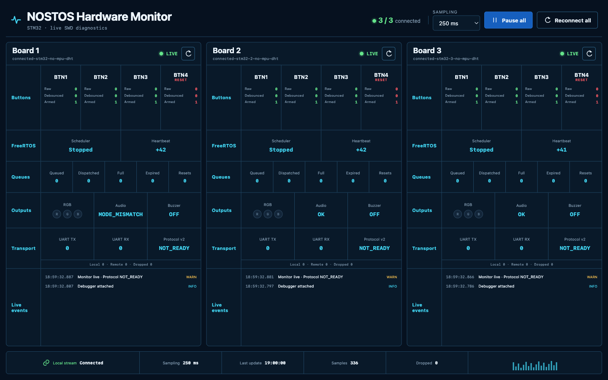

<div align="center">

# NOSTOS

### 세 명의 라이더, 하나의 공유 상태

STM32F411RE의 로컬 판단과 ESP32-S3 Bluetooth Mesh를 결합해<br>
그룹 라이딩의 속도·환경·움직임·안전 신호를 함께 전달하는 임베디드 시스템입니다.

[](https://www.st.com/en/microcontrollers-microprocessors/stm32f411.html)
[](https://www.espressif.com/en/products/socs/esp32-s3)
[](https://www.freertos.org/)
[](firmware/VERSION)

[프로젝트 구조](#시스템-구조) · [빠른 시작](#빠른-시작) · [하드웨어](#세-개의-라이더-노드) · [문서](#문서-지도)

</div>

---

## 왜 NOSTOS인가

라이더 한 명이 볼 수 있는 정보는 제한적입니다. NOSTOS는 각 자전거의 센서와 버튼 입력을 하나의 그룹
상태로 연결해, 앞·중간·뒤 라이더가 필요한 신호를 같은 순간에 인지하도록 설계되었습니다.

| 로컬 인지 | 그룹 전달 | 즉각적인 피드백 |
| :---: | :---: | :---: |
| 버튼·온습도·움직임 감지 | UART와 Bluetooth Mesh | OLED·RGB·오디오·부저 |
| STM32가 입력과 로컬 안전 판단을 담당합니다. | ESP32-S3가 메시지와 Mesh 통신을 담당합니다. | 각 노드가 상황을 눈과 귀로 알립니다. |

## 시스템 구조

```mermaid
flowchart LR
    IN["Buttons · DHT11 · MPU6050"] --> STM["STM32F411RE<br/>Sense · Decide · Act"]
    STM <-->|"UART"| ESP["ESP32-S3<br/>Message · State · Schedule"]
    ESP <-->|"Bluetooth Mesh"| GROUP(("Rider Group"))
    GROUP <-->|"Bluetooth Mesh"| PEER["Peer ESP32-S3"]
    PEER <-->|"UART"| OUT["Peer STM32<br/>OLED · RGB · Audio · Buzzer"]

    classDef input fill:#eef8ff,stroke:#38a3db,color:#16324f;
    classDef mcu fill:#eaf1ff,stroke:#2463eb,color:#102a56;
    classDef radio fill:#fff0ed,stroke:#ef5b4c,color:#57221d;
    classDef mesh fill:#eafbf4,stroke:#18a873,color:#0b4935;
    class IN input;
    class STM,OUT mcu;
    class ESP,PEER radio;
    class GROUP mesh;
```



활성 펌웨어는 [`firmware/`](firmware/) 한 벌이며 STM32, ESP32-S3, 공통 애플리케이션 프로토콜을 함께
관리합니다. 버전 선택 없이 [`firmware/protocol/`](firmware/protocol/)의 단일 프로토콜 계약을 사용합니다.

## 세 개의 라이더 노드

| 노드 | 역할 | 전용 센서 | 로컬 출력 |
| :---: | --- | --- | --- |
| **Rider 1** | 속도 / 기본 노드 | XOSS CSC 속도 센서¹ | OLED · RGB · Audio · Buzzer |
| **Rider 2** | 환경 정보 노드 | DHT11 온·습도 | OLED · RGB · Audio · Buzzer |
| **Rider 3** | 움직임·낙상 감지 노드 | MPU6050 | OLED · RGB · Audio · Buzzer |

각 노드는 **STM32F411RE + ESP32-S3-N16R8** 한 쌍으로 구성됩니다. 정확한 장치 역할은
[`DEVICES.md`](DEVICES.md), 전원·핀·배선은 [`PINS.md`](PINS.md)를 기준으로 합니다.

<sub>¹ XOSS BLE driver는 구현되어 있으며, 실물 센서 연결 검증은 남아 있습니다.</sub>

## 빠른 시작

저장소 루트에서 개발 환경을 확인하고, 변경한 대상만 검사·빌드합니다.

```bash
# 개발 환경 진단
bash firmware/tools/fw doctor

# 정적 검사
bash firmware/tools/fw check stm32
bash firmware/tools/fw check esp32

# 증분 빌드
bash firmware/tools/fw build stm32
bash firmware/tools/fw build esp32
```

`check`와 `build`는 캐시를 재사용하며 장비나 release receipt를 변경하지 않습니다. ESP32 빌드에는
**ESP-IDF v5.5.5**가 필요합니다. Flash·패키징·릴리스 절차는 안전 제약을 포함한
[`firmware/README.md`](firmware/README.md)를 먼저 확인하세요.

<details>
<summary><strong>주요 디렉터리 펼쳐보기</strong></summary>

```text
nostos/
├── firmware/
│   ├── stm32/              # 센서, 버튼, 로컬 출력, FreeRTOS 애플리케이션
│   ├── esp32/              # UART bridge, 메시지 상태, Bluetooth Mesh
│   ├── protocol/           # 단일 application protocol과 host tests
│   └── tools/fw            # check, build, test, release, flash 진입점
├── apps/
│   ├── nostos-hardware-monitor/  # 3대 STM32 Web Monitor와 단일 보드 TUI
│   └── mock-lab/                  # 하드웨어 없는 UI 시뮬레이션
├── docs/
│   ├── adr/                # 아키텍처 결정 기록
│   ├── schematics/         # KiCad 회로도와 export
│   ├── wiring-diagrams/    # 장치별 배선 그림
│   ├── study/              # 학습·검증 문서
│   └── media/              # NOSTOS 소개 미디어
└── releases/               # 릴리스 인덱스와 기준선
```

전체 구조와 버전 정책은 [`STRUCTURE.md`](STRUCTURE.md)를 따릅니다.

</details>

## Hardware Monitor

세 STM32의 버튼, FreeRTOS heartbeat, queue, 로컬 출력, UART와 프로토콜 상태를 한 화면에서 비교할 수
있습니다. 하드웨어 없이 `web:demo`로 인터페이스를 먼저 확인하는 것도 가능합니다.

[](apps/nostos-hardware-monitor/README.md)

<p align="center"><sub>이미지를 클릭하면 실행 방법과 관측 항목을 볼 수 있습니다.</sub></p>

## 검증 원칙

> **Build passed ≠ Hardware verified**

호스트 검사, 빌드, Flash, 부팅, UART, Mesh 전송, 물리 출력은 서로 다른 검증 단계입니다. 특히 Mesh API가
메시지를 수락했다는 사실만으로 전달 성공을 판단하지 않습니다. 송신 ACK, 수신 노드, 실제 출력까지 확인한
기록만 end-to-end 증거로 취급합니다.

## 문서 지도

| 찾는 정보 | 문서 |
| --- | --- |
| 프로젝트 요구사항과 범위 | [`REQUIREMENT.md`](REQUIREMENT.md) · [`CONTEXT.md`](CONTEXT.md) |
| 펌웨어 명령과 안전한 개발 흐름 | [`firmware/README.md`](firmware/README.md) · [`WORKFLOW.md`](WORKFLOW.md) |
| 장치 역할과 노드 구성 | [`DEVICES.md`](DEVICES.md) · [`RIDER-1.md`](RIDER-1.md) · [`RIDER-2.md`](RIDER-2.md) · [`RIDER-3.md`](RIDER-3.md) |
| 배선과 회로도 | [`PINS.md`](PINS.md) · [`docs/schematics/nostos/`](docs/schematics/nostos/) · [`docs/wiring-diagrams/`](docs/wiring-diagrams/) |
| 프로토콜 계약 | [`firmware/protocol/README.md`](firmware/protocol/README.md) |
| 검증 상태와 학습 기록 | [`docs/study/NOSTOS_QA.md`](docs/study/NOSTOS_QA.md) |
| 릴리스 정책과 기록 | [`releases/README.md`](releases/README.md) |
| 작업·검증·장비 안전 규칙 | [`AGENTS.md`](AGENTS.md) |

---

<div align="center">

**NOSTOS** — *Leave together. Return together.*

</div>
