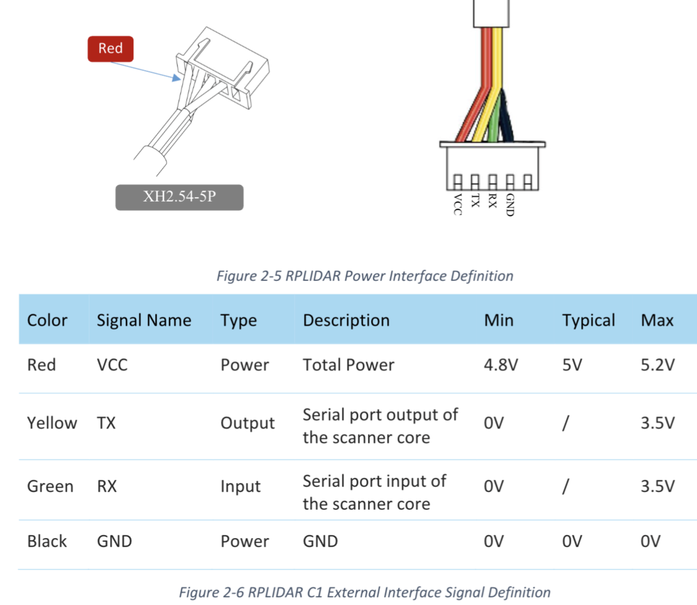
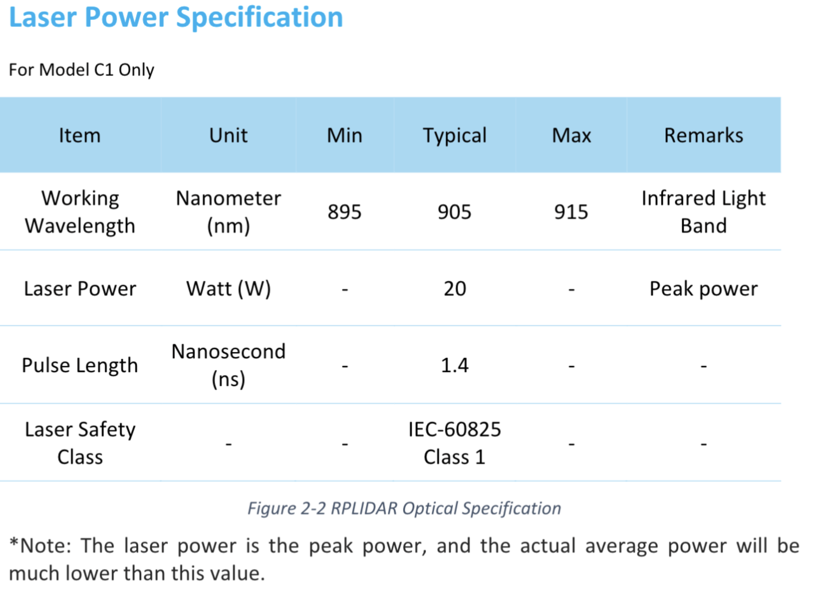
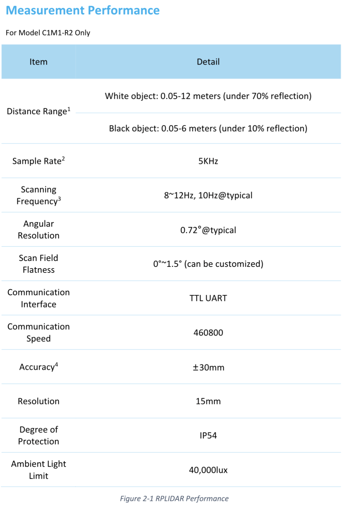
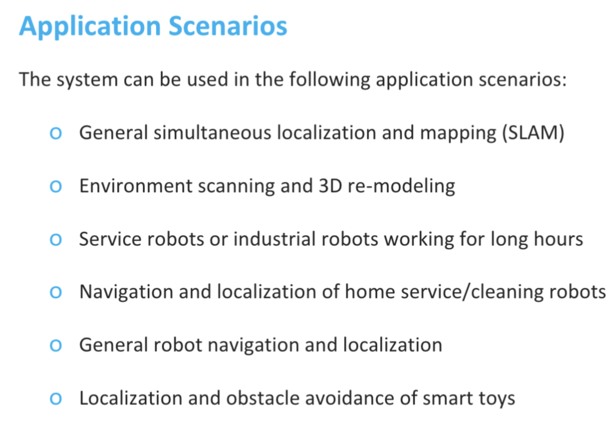
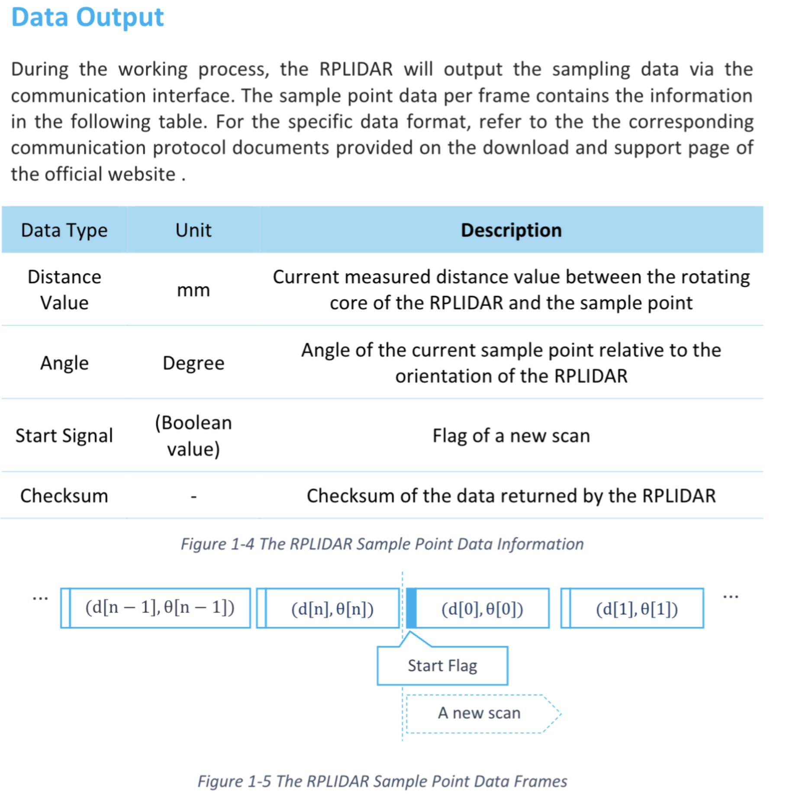
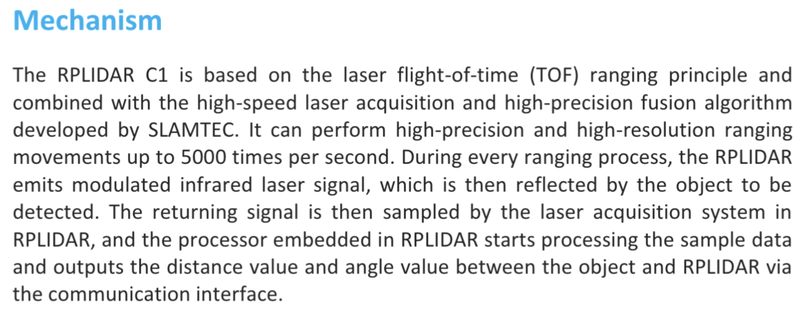

# RPLIDAR C1 데이터시트 발췌 보관

- 저장일: 2026-08-29
- 출처: 사용자가 제공한 데이터시트 영문 Introduction 본문과 캡처 이미지 6장.
- 범위: 원본 PDF 전체가 아닌, 이번에 제공된 발췌 자료만 보관한다.
- 보존 방식: 이미지 파일은 변환 없이 원본 그대로 복사했다. 영문 본문은 붙여넣기의 행 끝 역슬래시와 줄바꿈만 정리하고 문구를 유지했다.
- 문서에 적힌 사양을 보관한 것이며, 실제 장비의 핀 방향·배선·전원·동작을 검증한 기록은 아니다.

## Introduction — 사용자 제공 영문 본문

3 / 20

Copyright (c) 2009-2013 RoboPeak Team

Copyright (c) 2013-2023 Shanghai Slamtec Co., Ltd.

The RPLIDAR C1 is a next-generation low-cost 360 degree 2D laser scanner (LIDAR) solution developed by SLAMTEC. It can take up to 5000 samples of laser ranging per second with high rotation speed. Equipped with contactless power and signal transmission technology, it breaks the life limitation of traditional LIDAR systems to work stably for a long time.

RPLIDAR C1 has a measuring distance of up to a radius of 12 meters and a low blind range of only 0.05 meters. It easily accomplishes scanning and measuring objects at various distances and achieves obstacle avoidance. RPLIDAR C1 not only delivers powerful performance but also features a compact and agile design. It is small and has low levels of noise and vibration, making it easy to integrate into various applications. Its compact size and versatility open up a wide range of possibilities and uses. RPLIDAR C1 can be used in home robot, educational ROS car, commercial robot, autonomous vehicles in low-speed parks, and parking lot space monitoring. Therefore, it can be widely applied in many consumer-oriented business scenarios.

The typical scanning frequency of RPLIDAR C1 is 10Hz (600rpm). With the 10Hz scanning frequency, the sample rate is 5KHz, and the angular resolution is 0.72°.

With SLAMTEC’s self-developed fusion ranging technology, RPLIDAR C1 can provide 2.5D multidimensional information, including position information data and reflectivity data. Meanwhile, before leaving the factory, every RPLIDAR C1 has passed strict testing to ensure the laser output power meets the eye-safety standard of IEC-60825 Class 1.

## 1. 전원 인터페이스와 핀 정의

사용자 첨부 #1. Figure 2-5 RPLIDAR Power Interface Definition / Figure 2-6 RPLIDAR C1 External Interface Signal Definition.

## 2. Laser Power Specification

사용자 첨부 #2. For Model C1 Only / Figure 2-2 RPLIDAR Optical Specification. Peak power와 average power를 구분하는 원문 주석도 이미지에 보존한다.

## 3. Measurement Performance

사용자 첨부 #3. For Model C1M1-R2 Only / Figure 2-1 RPLIDAR Performance. 이미지에는 각주 참조 번호 1~4가 있지만 해당 각주의 본문은 포함돼 있지 않다.

## 4. Application Scenarios

사용자 첨부 #4. 데이터시트의 적용 사례 목록 원문.

## 5. Data Output

사용자 첨부 #5. Figure 1-4 The RPLIDAR Sample Point Data Information / Figure 1-5 The RPLIDAR Sample Point Data Frames.

## 6. Mechanism

사용자 첨부 #6. TOF 측정 원리와 거리·각도 출력에 관한 데이터시트 원문.

## 첨부 원본과 보관 파일 대응

| 첨부 | 원본 파일명 | 보관 파일 |
| --- | --- | --- |
| 1 | codex-clipboard-12229ded-a1c2-46a7-9433-a54e5c4efd62.png | images/01-power-interface.png |
| 2 | codex-clipboard-2ceed849-d5e1-4727-95ca-78a16e348566.png | images/02-laser-power.png |
| 3 | codex-clipboard-249e2a3a-168c-477e-9740-adbdf1ac9c7a.png | images/03-measurement-performance.png |
| 4 | codex-clipboard-09a353be-d3a9-48da-a47c-7ea4d951ca9b.png | images/04-application-scenarios.png |
| 5 | codex-clipboard-956feb94-167f-42b0-b865-58a95207d4a6.png | images/05-data-output.png |
| 6 | codex-clipboard-feaf2658-914a-4418-a90f-66188c11c258.png | images/06-mechanism.png |
