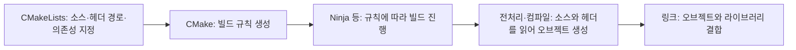

> 이관 원문: `docs/04-records/BRINGUP-NOTES.md`. 현재 실행 경로는 [팀원 시작 안내](../00-team/START.md)를 따른다. 아래의 과거 명칭·명령·검증 범위는 기록 당시 내용이다.

# ESP32-S3 Firmware / SW Bring-up — 상세 학습 기록

[기록 목록](README.md) · [학습 순서](../02-learning/README.md) · [전체 시작 메뉴](esp-ble-original-index.md)

> 아래는 기존 이해·질문과 검토 기록이다. 작성 중인 항목과 당시 설명을 보존했으며, 현재 검증 상태는 [STATUS](../01-project/STATUS.md)에서 확인한다.

[짧은 단계별 설명으로 돌아가기](../03-reference/BUILD-AND-BOOT.md)

펌웨어 빌드·플래싱·부팅 및 최소 실행 확인을 이해하며 만드는 팀 설명 자료.

이 문서와 발표에서는 사용자가 선택한 **Firmware / SW Bring-up**을 작업 명칭으로 사용한다. 현재 다루는 기초 범위는 **펌웨어 빌드 → 보드에 기록 → 부팅 → 새 펌웨어의 최소 실행 확인**이다. 전체 하드웨어 검증이나 BLE 통신 검증 완료를 뜻하지 않는다.

목표: 위 과정을 내 말로 설명하고, 그 설명을 팀 공유와 발표에 사용할 수 있게 정리한다.

상태: 공동 작성 중. 사용자 요청에 따라 블루투스·펌웨어·Build·Flash·Boot의 큰 개념을 먼저 다룬다. 환경 활성화의 이해 기록은 유지하고, CMake 세부 설명과 질문은 나중으로 미룬다. 아래 큰 그림은 설명 초안이며 이해 확인 대기다.

## 먼저 볼 큰 그림: 블루투스를 쓰는 펌웨어를 만들고 설치한다

### 블루투스와 ESP32-S3

블루투스는 장치들이 전파를 이용해 데이터를 주고받는 무선 통신 기술이다. 현재 프로젝트의 ESP32-S3에서는 그중 BLE(Bluetooth Low Energy)를 사용한다. 예를 들어 센서 상태를 다른 보드나 스마트폰으로 보내는 프로그램을 만들 수 있다.

보드에 BLE 하드웨어가 있다는 것과 원하는 통신 동작이 구현되어 있다는 것은 다르다. 무엇을 언제 보내고, 받은 데이터를 어떻게 처리할지는 보드에서 실행할 프로그램으로 정해야 한다. ESP-IDF는 이때 활용할 BLE 소프트웨어와 API를 제공한다. [Espressif BLE 개요](https://docs.espressif.com/projects/esp-idf/en/v5.5/esp32s3/api-guides/ble/overview.html)

### 펌웨어란?

펌웨어(Firmware)는 보드 같은 장치에서 실행되며 하드웨어의 동작을 제어하는 소프트웨어다. 여기서는 센서를 읽거나 BLE로 데이터를 보내도록 만든 프로그램이 해당한다.

우리 동작을 구현한 코드와 필요한 ESP-IDF 코드를 이용해 펌웨어를 만들고, 보드의 Flash 메모리에 기록한 뒤 실행한다. BLE 기능을 넣지 않은 최소 펌웨어도 만들 수 있으므로, `idf.py build` 자체가 BLE 기능을 자동으로 추가하는 것은 아니다.


| 말 | 큰 의미 | 명령 또는 계기 |
|---|---|---|
| Build | Mac에서 펌웨어 파일들을 만든다 | `idf.py build` |
| Flash / 플래싱 | 만든 파일들을 보드의 Flash 메모리에 기록한다 | `idf.py -p PORT flash` |
| Boot / 부팅 | 보드가 시작 절차를 거쳐 설치된 프로그램을 실행한다 | 전원 켜기 또는 리셋 |
| Monitor / 실행 확인 | 보드가 보내는 실행 로그를 확인한다 | `idf.py -p PORT monitor` |

`PORT`는 대상 보드의 실제 포트 경로다. 위 명령은 설명용이며 이번 문서 갱신에서 실행하지 않았다. `flash` 명령은 필요한 Build도 수행하지만, 개념상 만들기와 설치하기는 구분한다. [공식 Build·Flash·Monitor 안내](https://docs.espressif.com/projects/esp-idf/en/stable/esp32s3/get-started/start-project.html)

파일을 기록하는 행위를 펌웨어 설치라고 부르기도 하지만, **이 문서에서 설치 작업 또는 기초 Bring-up의 완료를 판정할 때는 새 펌웨어의 부팅과 최소 실행까지 확인한다.** Flash 성공만으로 실행 성공을 판단하지 않는다. `idf.py build`만 수행한 상태는 아직 보드에 기록한 것도 아니다. 부트로더·파티션 테이블의 내부 역할은 뒤에서 다룬다.

발표용 설명 초안:

> “BLE 기능을 개발하기 전에 Firmware / SW Bring-up을 진행합니다. 최소 펌웨어를 빌드해 ESP32-S3에 기록하고, 재부팅 후 새 프로그램의 실행 로그를 확인합니다. 이를 통과한 뒤 BLE 기능을 추가하고 실제 통신을 검증합니다.”

이해 확인 기록:

- 작성자의 질문: “부팅하기 까지 가야 펌웨어 설치 아닐까?”
- 정리한 기준: 파일 기록과 작업 완료 판정은 다르다. 이 문서에서는 부팅과 최소 실행 확인까지를 기초 Bring-up 완료 기준으로 삼는다.
- 명칭 선택: “Firmware / SW Bring-up 이걸로 하자.”
- BLE 수신·송신 같은 후속 기능은 별도 검증한다. 실제 보드의 완료 여부는 실행 증거로 판정하며, 이 용어 합의 자체가 하드웨어 시험 결과는 아니다.

이제 이 큰 그림을 먼저 이해한다. 아래 CMake·헤더·링크 설명과 기존 세부 질문은 지금 답하지 않아도 된다.

## 함께 작성하는 방식

한 번에 한 주제만 다룬다.

1. 쉬운 설명과 현재 프로젝트의 예제를 읽는다.
2. 확인 질문에 내 말로 답한다.
3. 답에서 맞게 이해한 부분과 보완할 부분을 확인한다.
4. 확인된 설명을 문서에 반영하고 발표용 한 문장으로 정리한다.

사용자가 답하기 전에는 이해 확인을 완료 처리하거나 사용자의 설명을 대신 작성하지 않는다.

## 문서의 범위와 상세 학습 목차

현재 `layers/`의 ESP32-S3 학습 프로젝트를 기준으로 한다. 별도의 ESP32-C3 Mesh 예제와 구분한다.

이 문서에서 말하는 기초 **Firmware / SW Bring-up**은 개발 환경과 장치를 확인하고, 펌웨어를 Build·Flash한 뒤 부팅과 최소 실행을 검증하는 절차다. 기존 실행 자료의 `Bootloading Workflow` 표기는 유지하되, 팀 설명과 발표에서는 합의한 명칭을 사용한다. **부팅(Boot)** 자체는 이 전체 절차 중 보드가 실행을 시작하는 과정이다.

| 순서 | 함께 설명할 주제 | 상태 |
|---|---|---|
| 00 | `idf.py`는 어디에 있고, 왜 프로젝트 폴더에서 실행할 수 있는가? | 환경 활성화·실행 위치 이해 확인 완료 |
| 00-1 | `CMakeLists.txt`는 무엇을 빌드하도록 지정하는가? | 기본 역할 답변 기록 / 세부 학습은 나중에 |
| 01 | Build, Flash, Runtime은 무엇이 다른가? | 설명 초안 / 이해 확인 대기 |
| 02 | USB 장치와 실제 ESP32-S3 칩을 왜 먼저 확인하는가? | 작성 대기 |
| 03 | Build가 만드는 bootloader, partition table, application은 무엇인가? | 작성 대기 |
| 04 | Flash 과정은 무엇을 어디에 기록하는가? | 작성 대기 |
| 05 | 리셋 후 ROM → second-stage bootloader → application 초기화 → `app_main()`은 어떻게 이어지는가? | 작성 대기 |
| 06 | 실행 로그로 어디까지 증명할 수 있으며, Layer별 학습과 어떻게 연결되는가? | 작성 대기 |

`Layer 0`, `Layer 1` 등은 차례로 설치하는 부트로더가 아니라 독립적인 펌웨어 학습 단계다. 현재 각 Layer를 Flash하면 해당 application이 보드의 이전 application을 대체한다. 자세한 학습 순서는 [Layer Roadmap](../02-learning/LAYER-ROADMAP.md)을 참고한다.

<details>
<summary>나중에 볼 세부 내용: 도구 실행 환경과 CMake 빌드 설정</summary>

## 00. 도구의 위치와 빌드할 프로젝트의 위치

### 핵심 설명

`idf.py`는 실제 Python 스크립트다. 현재 설치에서 파일은 `/Users/kafka/esp/esp-idf-v5.5.5/tools/idf.py`에 있다. 프로젝트마다 이 파일을 복사할 필요는 없다.

`source /Users/kafka/esp/esp-idf-v5.5.5/export.sh`는 현재 셸의 ESP-IDF 환경을 활성화한다. 이 과정에서 `idf.py`가 들어 있는 폴더를 PATH에 추가하고, Python·컴파일러 등 필요한 도구의 환경을 준비한다. 사용자가 환경변수를 일일이 따로 수정하는 절차는 아니다.


| 구분 | 결정하는 것 | 현재 Layer 0 예 |
|---|---|---|
| PATH | 어떤 실행 파일을 찾아 실행할지 | SDK의 `tools/idf.py` |
| IDF_PATH | 사용할 ESP-IDF의 위치 | `/Users/kafka/esp/esp-idf-v5.5.5` |
| 현재 프로젝트 디렉터리 | 기본적으로 어느 프로젝트를 빌드할지 | `/Users/kafka/Workspace_AI/esp-ble/layers/layer-0` |

기본 실행 예시는 다음과 같다. 이 문서 갱신 중에는 아래 Build 명령을 실행하지 않았다.

```bash
source /Users/kafka/esp/esp-idf-v5.5.5/export.sh
cd /Users/kafka/Workspace_AI/esp-ble/layers/layer-0
idf.py build
```

이미 환경이 활성화된 터미널에서는 매번 `source`할 필요가 없다. 이 방식의 환경 활성화는 `.zshrc`에 alias를 추가하는 작업이 아니다.

기본 사용법에서는 프로젝트 최상위 `CMakeLists.txt`가 있는 폴더로 이동한다. 참고로 `idf.py -C /프로젝트/경로 build`처럼 대상 폴더를 명시할 수도 있으므로, 반드시 `cd`만 가능한 것은 아니다. 이 옵션은 아직 이해 확인 범위에 포함하지 않는다.

### 이해 확인 00 — 확인 완료

질문: `idf.py` 파일이 있는 폴더와 `idf.py build`를 실행하는 프로젝트 폴더는 서로 달라도 될까? 왜 그럴까?

작성자의 실제 답변:

> 그렇지. 그 전에 source ...export.sh 하니까 그 ENV 세팅이 되서 idf.py 가 프로젝트 디렉토리에 없어도 빌드 가능하지. 대신 그 프로젝트 디렉토리에서 we should run the command

- 확인한 이해: 환경 활성화 후 PATH로 SDK의 `idf.py`를 찾으므로 프로젝트 안에 `idf.py`가 없어도 된다. 기본 사용법은 빌드할 프로젝트 폴더에서 명령을 실행하는 것이다.
- 이해 확인 범위: 실행 파일의 위치, 환경 활성화, 기본 실행 디렉터리의 구분.
- 아직 확인하지 않은 것: `-C` 옵션, CMake 내부 동작, 세 Build 결과물의 역할, Build와 보드 실행의 차이.

### 발표용 설명 — 확인한 내용을 정리

> “ESP-IDF 환경을 활성화하면 터미널이 SDK에 있는 idf.py를 찾을 수 있습니다. 따라서 idf.py를 프로젝트에 복사하지 않고, 빌드할 프로젝트 폴더에서 명령을 실행합니다.”

참고: [공식 idf.py 도구와 `-C` 옵션 설명](https://docs.espressif.com/projects/esp-idf/en/v5.5/esp32s3/api-guides/tools/idf-py.html).

## 00-1. CMakeLists.txt는 빌드 구성을 설명한다

### 작성자의 설명

> 어떤 라이브러리를 불러올지
> 환경변수 설정 등
> 어떤 헤더랑 소스파일들 찾아내고 빌드할때 링크하고 이런걸 설정하는걸로 알고잇어

빌드할 소스, 헤더 검색 경로, 사용할 라이브러리의 관계를 정한다는 큰 틀은 맞다. 다음 두 가지는 구분해서 설명한다.

- `export.sh`는 현재 셸의 도구 실행 환경을 준비한다. `CMakeLists.txt`는 프로젝트의 빌드 구성을 기술한다. CMake에서도 변수나 자체 프로세스의 환경을 다룰 수 있지만, 앞서 한 셸 환경 활성화와 같은 작업은 아니다.
- 헤더는 보통 소스를 전처리·컴파일할 때 읽는다. 링크 단계에서 결합하는 것은 컴파일된 오브젝트 파일과 라이브러리이며, 헤더 파일 자체를 링크하는 것은 아니다.

### 실제 Layer 0의 두 파일

프로젝트 최상위 [CMakeLists.txt](../../code/layers/layer-0/CMakeLists.txt):

```cmake
cmake_minimum_required(VERSION 3.16)

include($ENV{IDF_PATH}/tools/cmake/project.cmake)

project(esp32s3_layer_0)
```

가운데 줄은 이미 설정된 환경변수 `IDF_PATH`를 **읽어**, ESP-IDF의 CMake 빌드 설정을 불러온다. C의 `#include`로 헤더를 포함하는 문장과는 다르다. 마지막 줄은 프로젝트 이름을 정한다.

`main` 컴포넌트의 [CMakeLists.txt](../../code/layers/layer-0/main/CMakeLists.txt):

```cmake
idf_component_register(
    SRCS "main.c"
    INCLUDE_DIRS "."
)
```

- `SRCS "main.c"`: 이 컴포넌트에서 컴파일할 소스 파일을 지정한다.
- `INCLUDE_DIRS "."`: 이 CMakeLists가 있는 `main/` 폴더를 헤더 검색 경로에 추가한다. 폴더 안의 모든 C 파일을 컴파일하라는 뜻은 아니다.
- 라이브러리 의존성은 ESP-IDF에서 `REQUIRES` / `PRIV_REQUIRES` 등으로 표현할 수 있다. 현재 위 파일에는 그 항목이 없으며, `main`은 ESP-IDF 빌드 시스템의 특별한 의존성 처리를 받는다. 세부 의존성 규칙은 나중에 다룬다.



### 이해 확인 00-1 — 사용자 요청으로 나중에 진행

현재 `main/` 폴더에 새 `sensor.c` 파일을 만들기만 하고 위 CMakeLists를 그대로 두었다면, `sensor.c`도 자동으로 컴파일 대상이 될까? 위 코드의 어느 항목을 보고 판단했는지 설명해 보자.

- 확인한 이해: CMakeLists가 소스·헤더 검색 경로·라이브러리 등 빌드 구성을 정한다는 기본 역할.
- 추가 확인 대기: 셸 환경과 CMake 설정의 구분, 헤더 검색과 소스 등록의 구분, 컴파일과 링크의 구분.
- 위 질문에 대한 내 답변: 답변 대기.

발표용 설명 초안:

> “CMakeLists.txt에는 어떤 소스를 컴파일하고, 헤더를 어디서 찾으며, 어떤 라이브러리에 의존하는지 적습니다. CMake는 이 정보를 바탕으로 실제 빌드 도구가 사용할 규칙을 만듭니다.”

참고: [ESP-IDF v5.5 Build System](https://docs.espressif.com/projects/esp-idf/en/v5.5/esp32s3/api-guides/build-system.html).

</details>

## 01. Build 성공과 보드 실행 성공은 다르다

### 핵심 설명

**Build는 실행할 파일을 만드는 일, Flash는 그 파일을 보드에 기록하는 일, Runtime 확인은 보드에서 실제로 실행되는지 확인하는 일이다.**


| 구분 | 쉬운 뜻 | 현재 프로젝트의 예 | 이것만으로는 알 수 없는 것 |
|---|---|---|---|
| Build | C 코드와 필요한 SDK 코드를 실행 이미지로 만들기 | `idf.py build` | 보드에 기록됐는지, 보드에서 실행되는지 |
| Flash | 만든 이미지를 보드의 비휘발성 Flash 메모리에 기록하기 | `idf.py -p PORT flash` | 새 앱이 정상 실행됐는지 |
| Runtime 확인 | 보드에서 실제 앱 실행의 증거를 받기 | 시리얼에서 `[LAYER-0] RUNTIME_OK` 수신 | BLE 송수신 등 아직 시험하지 않은 기능의 성공 |

`PORT`는 실제 확인한 장치 경로로 바꿀 자리다. 위 명령은 설명용이며, 이 문서를 작성하면서 실행하지 않았다.

참고로 `idf.py flash`는 필요한 Build도 수행한다. 명령 하나가 여러 작업을 이어서 하더라도, 파일 생성·기록·실행의 성공 여부는 나누어 확인해야 한다. [Espressif 공식 Build / Flash 안내](https://docs.espressif.com/projects/esp-idf/en/stable/esp32s3/get-started/start-project.html)

### 현재 코드와 연결하기

[Layer 0의 main.c](../../code/layers/layer-0/main/main.c)에서 `app_main()`은 먼저 `BOOT_SUCCESS`를 출력하고, 반복문에서 카운터를 증가시키며 `RUNTIME_OK`를 출력하도록 작성되어 있다.

```c
ESP_LOGI(TAG, "[LAYER-0] RUNTIME_OK count=%" PRIu32, alive_count);
```

이 코드를 **읽는 것**은 “실행되면 어떤 로그가 나오는가”를 확인하는 일이다. 대상 보드의 시리얼에서 이 로그를 **받는 것**은 앱 실행의 증거를 확인하는 일이다.

[bootload.sh](../../code/layers/layer-0/bootload.sh)는 Build와 Flash가 끝난 뒤 시리얼에서 `[LAYER-0] RUNTIME_OK`가 수신되는지 확인한다. 코드에 따르면 이 marker를 찾지 못하면 최종 PASS로 처리하지 않는다. 이 짧은 확인은 앱 실행의 증거이지 장시간 안정성이나 BLE 동작 전체의 보증은 아니다.

### 이해 확인 01 — 아직 답하지 않음

보드를 Mac에서 분리한 상태로 `idf.py build`만 성공했다고 하자. 이때 무엇까지 확인한 것이며, 무엇은 아직 확인하지 못한 걸까?

- 내 설명: 답변 대기
- 함께 확인한 내용: 답변 후 기록
- 이해 상태: 미확인

### 발표용 한 문장 — 설명 초안

> “코드를 빌드했다는 것과 보드가 실행했다는 것은 다릅니다. 우리는 실행 파일 생성, 보드 기록, 실제 실행 로그 확인을 나누어 검증합니다.”

## 참고 자료와 검증 범위

- [Layer 0 실행 절차와 PASS 기준](../layers/layer-0/README.md)
- [각 Layer의 독립 펌웨어 원칙](../layers/README.md)
- [기존 BLE 용어 이해 기록](MY_UNDERSTANDING.md) — 이 문서의 이해 확인 기록과 별도로 유지한다.
- [Espressif ESP32-S3 Application Startup Flow](https://docs.espressif.com/projects/esp-idf/en/stable/esp32s3/api-guides/startup.html) — 05절에서 자세히 다룰 부팅 흐름의 공식 참고 자료.

작성 기준일: 2026-08-27. 현재 Layer 0 스크립트의 기본 SDK 경로는 ESP-IDF v5.5.5를 가리킨다. 위 공식 문서의 `stable` 주소는 버전이 바뀔 수 있으므로 세부 동작을 설명할 때 로컬 SDK와 다시 대조한다.

이번 작성에서는 문서와 소스 코드를 읽었다. 새 Build, Flash, 시리얼 수신 또는 하드웨어 검증을 수행한 기록은 아니다.
