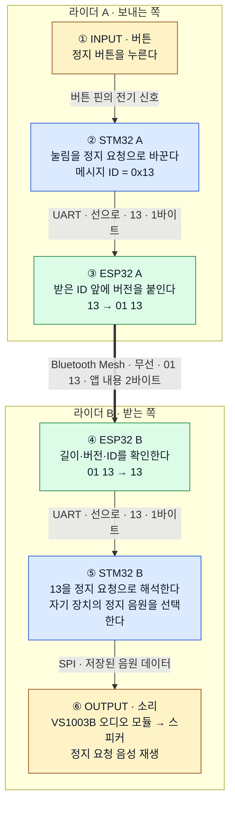

# 02. 정지 요청 하나의 전체 흐름

[← 이전](01-first-steps.md) · [목차](README.md) · [다음: 메시지 번호 →](03-message-id.md)

**A가 버튼을 누르면, B가 자기 장치의 정지 요청 음원을 재생합니다.**

정상 전달과 오디오 준비를 가정한 설명입니다. 모든 구간의 실물 시험 완료를 뜻하지 않습니다.

## 위에서 아래로 따라가기

## 그림에서 기억할 것

- **선으로 전달:** STM32 → ESP32와 ESP32 → STM32는 `13` 한 바이트입니다.
- **무선으로 전달:** ESP32 → ESP32는 앱 내용 `01 13` 두 바이트입니다.
- **출력:** 상대 STM32가 저장된 음원을 선택해 스피커로 재생합니다.

`13`은 정지 요청, `01`은 형식 버전입니다. 모두 **16진수 바이트**이며, 두 바이트는 무선 패킷 전체 크기가 아닙니다.

> 전달하려는 뜻은 계속 “정지 요청”입니다. 구간에 맞게 표현만 바뀝니다.

## 확인 질문

B에서 소리가 나려면 A가 음성 파일 전체를 Mesh로 보내야 할까요?

[답 확인](answers.md#lesson-02) · [그림의 코드 위치](code-map.md) · [그림에서 생략한 조건](delivery-and-limits.md)

---

[← 이전](01-first-steps.md) · [목차](README.md) · [다음: 메시지 번호 →](03-message-id.md)
