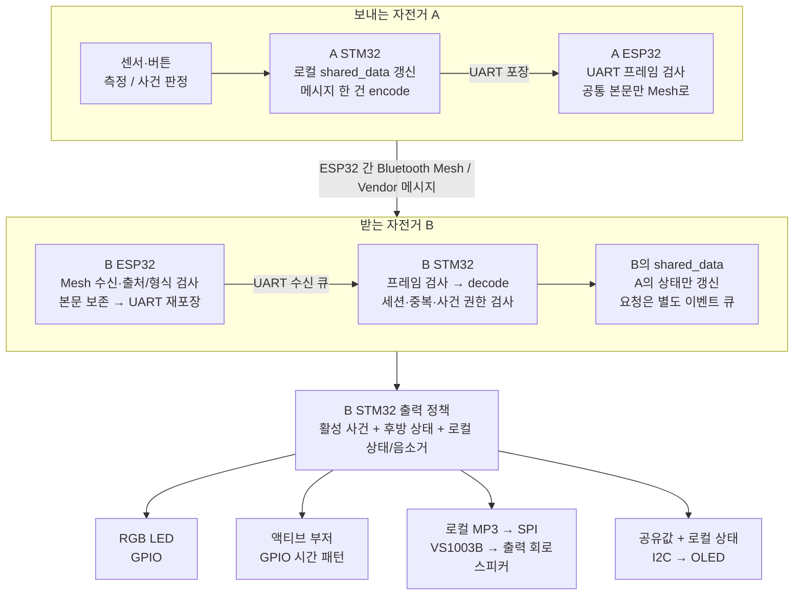

# shared_data → BLE Mesh → STM32 출력: 통합 설계

[아키텍처 목록](../README.md) · [KAF-373](https://linear.app/kafkasnowflake/issue/KAF-373)

> **2026-08-29 구현 후속:** 공통 v2 codec·UART·shared_data·ESP32 선택형 런타임·STM32 선택형 ISR/출력 경로와 모든 메시지의 호스트 시험을 구현했습니다. 호스트 회귀 및 v2 ON STM32 Debug/Release·ESP32-S3 전체 빌드도 통과했습니다. [구현 계약](../../../libs/protocol/V2.md)과 [one-stop 테스트](../../../tests/message-protocol/README.md)를 먼저 확인하세요. 아래 본문은 당시 설계/조사 이력을 보존하며 “제안/미구현” 표시는 작성 당시 기준입니다. 현재 기본 빌드는 여전히 v1이며, 승인 세션의 영속 복구·실물 배포/중계는 별도입니다.

**핵심:** 각 STM32는 `shared_data`라는 로컬 상태표를 갖습니다. 전송할 때는 그 표 전체가 아니라 **온습도·낙상 등 메시지 한 건**을 바이트로 만듭니다. ESP32는 이를 Mesh로 전달하고, 수신 STM32가 자기 상태표를 갱신한 후 출력을 결정합니다.

**TTL은 어디에?** BLE Mesh 네트워크 계층에 있습니다. 초기 TTL과 Relay 활성화는 설정하지만, TTL 감소·중계 중단은 ESP-IDF가 처리하므로 `shared_data`나 메시지 본문에 중복으로 넣지 않습니다. TTL은 시간 제한이 아니므로 “오래된 속도값인지”와 “이미 처리한 낙상인지”는 우리 상태 관리에서 따로 판단합니다.

| 합의한 것 | 아직 정해야 할 것 |
| --- | --- |
| 라이더/역할 1~3, 역할별 기능 사전 정의, capabilities 미전송 | 실제 역할별 센서 배정, 속도 생산자 |
| 온습도 내용 2바이트, heartbeat 내용 1바이트 | 상태 비트, 오류 코드 최종 배정 |
| 정수 저장·전송, 온도 0.1°C/습도 0.5%p 간격 | UART 경계·CRC·시간초과, 최종 헤더/상한 |
| 본인만 낙상 해제, 타인은 로컬 음소거 | 세션 승인·종료기록 보관·SOS UI·출력 우선순위 세부 정책 |

## 1. 전체 흐름 한눈에 보기



C 자전거도 B와 같은 수신 경로를 사용합니다. A의 로컬 출력도 같은 출력 정책으로 처리합니다. **환경값을 받았다고 부저가 울리는 것은 아닙니다.** 위 출력 분기는 메시지 종류와 현재 상태에 따라 선택합니다.

| 단계 | 담당 | 입력 → 결과 |
| --- | --- | --- |
| 측정/판정 | 송신 STM32 | 센서·버튼 → 값 또는 사건 |
| Encode | 공통 C codec | 메시지 구조 → 정해진 순서의 바이트 |
| UART 전송 | STM32 ↔ ESP32 | 바이트 → 경계·길이·CRC가 있는 프레임 |
| Mesh 전송 | ESP32 + ESP-IDF | 공통 본문 → Mesh 메시지 |
| 수신 검증/중계 | 수신 ESP32 | Mesh 본문·실제 발신 주소 → 검증된 UART 프레임 |
| Decode/적용 | 수신 STM32 | 바이트 → 메시지 → 자기 상태표의 해당 칸 |
| 출력 | STM32 서비스/드라이버 | 상태·이벤트 → GPIO / SPI / I2C |

## 2. shared_data에는 무엇이 들어가나?

### 이름과 소유권

| 이름 | 의미 | 네트워크로 통째 전송? |
| --- | --- | --- |
| `nostos_network_state_t shared_data` | 한 STM32가 보관하는 라이더 3명의 상태표 | 아니요 |
| `nostos_node_state_t` | 라이더 한 명의 최신 상태 | 아니요 |
| `nostos_message_t` | 지금 전달할 메시지 한 건 | 필요한 필드만 encode |
| `uint8_t wire[]` | 실제 공통 본문 바이트 | UART 안에 넣거나 Mesh API에 전달 |

역할은 설정에서 `source_id → role → 기능표`로 조회합니다. `role`/`capabilities`를 heartbeat에 반복해서 넣지 않습니다. source ID 1~3과 배열 인덱스 0~2의 대응은 등록표에서 확인합니다. 모르는 ID를 바로 배열 인덱스로 사용하지 않습니다.

```text
shared_data
└─ nodes[3]
   ├─ source_id       : 누구의 상태인가
   ├─ environment     : 온도 + 습도 + 값별 품질 + 최신 보고 정보
   ├─ speed           : 실제 속도 + 품질 + 최신 보고 정보
   ├─ rear            : 미확인 / 안전 / 경고 + 품질 + 최신 보고 정보
   ├─ fall            : 낙상 사건 참조 + 활성/종료/미확인
   ├─ sos             : 낙상과 별개인 SOS 사건
   ├─ health          : heartbeat status + 최신 보고 정보
   └─ reachability    : 최근 원격 연락 관찰
```

| 저장할 값 | 단위/형태 | 오류·최신성 |
| --- | --- | --- |
| 온도 | `int16_t`, °C × 10 | 온도만의 품질·마지막 정상값 시각 |
| 습도 | `uint16_t`, %RH × 10 | 습도만의 품질·마지막 정상값 시각 |
| 속도 | `uint16_t`, km/h × 10 제안 | 0 km/h와 미측정 구분 |
| 후방 | 미확인/안전/경고 | 센서 오류·연결 끊김을 SAFE로 바꾸지 않음 |
| 낙상·SOS | 발생자 + 종류 + 사건 세션 + 사건 번호 | 활성/종료 분리, 지연된 해제로 새 사건을 지우지 않음 |
| 건강 보고 | `status: uint8_t` | 보고가 없는데 값 0만 보고 정상으로 간주하지 않음 |
| 보고 정보 | 세션·순번·수신 시각·수신 여부 | 같은 보고 재전송은 새 측정이 아님 |

**로컬 전용:** UART 연결, 카운트다운·재감지 타이머, 사건별 음소거, 버튼 요청 큐, 오디오 재생 위치, OLED framebuffer, 센서 필터, 수신 중복/종료기록 캐시는 별도로 둡니다. 역할표와 raw 센서 데이터까지 매번 전송하지 않습니다.

## 3. Encoding: 값에서 전송 바이트 만들기

### 3-1. 먼저 메시지 종류를 고르기

아래 ID·공통 헤더는 제안입니다. **한 번 배포한 뒤에는 같은 `(version, type)`의 단위·길이·의미를 바꾸지 않습니다.**

| 메시지 | type 제안 | 내용(payload) | 내용 크기 | 헤더 포함 |
| --- | --- | --- | --- | --- |
| 감속·가속·안전/응원·정지 | `0x10`~`0x13` | 없음; 종류 자체가 요청 | 0B | 9B |
| 후방 안전/경고 | `0x20` / `0x21` | 없음; 종류 자체가 상태 | 0B | 9B |
| 낙상 / SOS | `0x30` / `0x31` | 사건 세션 4B + 사건 번호 2B | 6B | 15B |
| 속도 | `0x40` | valid 1B + 속도 정수 2B | 3B | 12B |
| 온습도 | `0x41` | 온도 코드 1B + 습도 코드 1B | **2B** | **11B** |
| 본인 낙상 해제 | `0x42` | 해제할 사건 세션 4B + 사건 번호 2B | 6B | 15B |
| 장치 heartbeat | `0x50` | status | **1B** | **10B** |

ACK의 처리 의미는 아직 미정이므로 완료 확인용으로 사용하지 않습니다. 후방 오류를 전달하는 상태 비트/별도 메시지도 미정입니다. 로컬 UART heartbeat와 원격 장치 heartbeat의 범위는 구분해야 합니다.

### 3-2. 공통 헤더: 9바이트 제안

```text
위치        0       1       2          3..6          7..8        9..
내용      version  type  source_id  session_id    sequence    payload
크기        1B      1B      1B          4B            2B       종류별
```

- 여러 바이트 정수는 Little-endian으로 명시적으로 씁니다. `sizeof(struct)`/구조체 `memcpy`/C enum의 메모리 크기로 전송하지 않습니다.
- 공통 본문에 별도 payload 길이를 반복 저장하지 않습니다. Mesh API의 수신 길이 또는 UART 바깥 프레임 길이에서 알 수 있습니다.
- 메시지 세션과 사건 생성 세션은 다를 수 있습니다. 세션/순번 소진과 재부팅 승인 정책은 아직 미정이며 순번을 조용히 0으로 돌리지 않습니다.

### 3-3. 실제 온습도 예제

라이더 2가 **36.2°C / 60.3%**를 측정했다고 합시다.

| 계산 | 결과 |
| --- | --- |
| 로컬 온도 정수 | `362` |
| 온도 코드 | `362 - 350 + 125 = 137 = 0x89` |
| 로컬 습도 입력 정수 | `603` |
| 습도 코드 | `(603 + 2) / 5 = 121 = 0x79` — 정수 나눗셈 |
| 수신 복원 | 온도 `137 - 125 + 350 = 362`, 습도 `121 × 5 = 605` |

습도는 합의한 대로 **60.5%**로 공유합니다. 송신 측에서도 공유 표시값과 수신 측 값의 차이를 피하려면 양자화된 값을 상태표에 적용합니다. 원본 센서 입력을 별도 로컬 진단에 보관하는 것은 가능합니다.

버전 2, source 2, session 1, sequence 7인 **공통 본문 11바이트**:

```text
02 41 02 | 01 00 00 00 | 07 00 | 89 79
버전/종류/출처    세션=1       순번=7   온도/습도 코드
```

온도 코드 0~250은 22.5~47.5°C, 습도 코드 0~200은 0~100%입니다. 특수값은 251=범위 미만, 252=범위 초과, 253=센서 오류, 254=미측정/미장착으로 제안합니다. 255 및 습도 코드 201~250은 예약값으로 거부합니다. 254의 미측정/미장착은 사전 기능표로 구분합니다. **검사 전에 좁은 정수로 cast하거나 값을 경계에 잘라 맞추지 않습니다.**

### 3-4. UART와 BLE Mesh의 포장은 다르다

```text
STM32 → ESP32 UART
[ UART 경계 | 본문 길이 | 위의 공통 본문 11B | CRC ]
                 ↓ UART 포장 해제
ESP32 → ESP32 BLE Mesh
[ Mesh가 관리하는 헤더·보안·Vendor opcode | 공통 본문 11B ]
                 ↓ 수신 후 같은 본문 보존
ESP32 → STM32 UART
[ UART 경계 | 본문 길이 | 같은 공통 본문 11B | 새 UART CRC ]
```

UART 그림은 **개념 배치**입니다. 실제 경계 값·escaping·길이 폭·CRC 종류/검사 범위·시간초과는 아직 확정하지 않았으므로 완성된 UART golden frame은 제시하지 않습니다.

Mesh에는 UART 경계·CRC까지 넣지 않습니다. ESP-IDF가 Mesh 전송의 보안 처리와 필요한 분할/재조립을 담당하고, 앱은 수신한 공통 본문을 해석합니다. 일반 Vendor 비분할 내용 예산은 8바이트이므로, 위 **11바이트 본문은 분할 전송 검토가 필요**합니다. 이는 무선 전체 패킷이 11바이트라는 뜻도 아닙니다. [ESP-IDF v5.5.5 FAQ](https://docs.espressif.com/projects/esp-idf/en/v5.5.5/esp32s3/api-guides/esp-ble-mesh/ble-mesh-faq.html#how-many-bytes-can-be-carried-when-sending-unsegmented-messages)

## 4. ESP32는 무엇을 decode하나?

**ESP32는 운반·검증, STM32는 센서/사건 해석과 출력 소유자**로 둡니다. 양쪽은 `libs/protocol/`의 공통 codec을 사용하도록 제안합니다.

| 보내는 ESP32 | 받는 ESP32 |
| --- | --- |
| UART에서 완성된 프레임만 받음 | ESP-IDF Mesh 수신 callback에서 본문·길이·실제 발신 주소를 받음 |
| 길이·CRC·버전·등록된 로컬 출처 검사 | 지원 버전·길이 상한·실제 Mesh 주소↔source ID 대조 |
| 알려진 종류는 같은 codec으로 payload 형식 검증 | 알려진 종류는 같은 codec으로 payload 형식 검증 |
| UART 포장을 벗긴 본문을 송신 큐에 복사 | 본문을 STM32행 큐에 복사하고 UART로 재포장 |
| Mesh가 준비됐는지 확인한 뒤 Vendor API 호출 | 수신한 메시지를 다시 응용 Mesh 방송하지 않음 |

ESP32에서 decode한 뒤에도 **원래 공통 본문을 그대로 보존**합니다. 출처를 중계 ESP32의 ID로 바꾸거나, 순번을 새로 발급하거나, 습도를 다시 양자화하지 않습니다. callback의 임시 포인터를 나중에 쓰지 않고 제한된 소유 버퍼/큐로 복사합니다.

현재 코드의 접점은 [mesh_node.c](../../../firmware/esp32/main/mesh_node.c)의 `ESP_BLE_MESH_MODEL_OPERATION_EVT`와 `esp_ble_mesh_server_model_send_msg()`, [bridge_runtime.c](../../../firmware/esp32/main/bridge_runtime.c)입니다. **현재 `mesh_node_send_event()`는 기존 2바이트 Mesh 본문만 받으므로 새 11바이트 본문을 지금 바로 전달할 수 없습니다.** 공통 codec·queue·UART 경로를 함께 확장해야 합니다. 새 Vendor opcode도 최종 결정 전입니다.

미지원 type은 성공한 센서 보고/명령으로 처리하지 않습니다. 정책이 정해지기 전에는 건너뛰고 진단하며, 불투명 중계를 허용하려면 지원하는 공통 헤더·출처·상한·경로 규칙을 먼저 정합니다. 모르는 version은 v2 헤더라고 가정해 읽지 않습니다.

Mesh 송신 API 성공은 상대 STM32의 상태 반영 완료가 아닙니다. 현재 server model 송신은 응용 확인 응답을 자동 보장하지 않습니다. [ESP-IDF FAQ §2.5](https://docs.espressif.com/projects/esp-idf/en/v5.5.5/esp32s3/api-guides/esp-ble-mesh/ble-mesh-faq.html#how-to-send-unacknowledged-messages)

## 5. STM32는 어떻게 읽고 shared_data를 갱신하나?

```text
UART 수신 ISR / DMA 알림
    ↓ 최소 작업으로 수신 버퍼·큐에 보관
app_process() 같은 단일 실행 흐름
    ↓ 프레임 경계·길이·CRC·timeout 확인
공통 decoder
    ↓ 버전 → type별 정확한 길이 → 값/예약 코드 검사
적용 규칙
    ↓ 등록 출처 → 승인 세션 → 중복/종류별 순서 → 사건 소유권
    ├─ 측정/사건/후방/heartbeat → shared_data의 해당 노드 갱신
    └─ 버튼 요청 → 제한된 일회성 요청 큐
출력 정책 갱신 → 장치별 service_process()
```

`decode`는 **바이트를 올바르게 읽는 단계**, `apply`는 **이 값을 지금 반영해도 되는지 판단하는 단계**입니다. 실패하면 기존 값·사건·출력을 임의로 바꾸지 않습니다. 미지원 payload 안의 `0x13`을 정지 요청으로 다시 실행하지 않습니다.

온습도 예제의 수신자를 **라이더 1**로 잡으면, 수신 STM32는 source 2를 등록표로 찾아 **자기 `shared_data.nodes[1]`**에 라이더 2의 온도 362/습도 605와 보고 정보를 기록합니다. 이 예제에서만 source 2→index 1로 등록됐다고 가정합니다. 라이더 1·3의 값과 기존 경고는 그대로 둡니다.

실제 Mesh 발신 주소와 source ID의 대조는 앞단 ESP32가 담당하고, STM32는 그 검증된 경로와 등록 ID를 바탕으로 상태를 적용합니다. CRC는 전송 오류 검사이지 발신자 인증이 아닙니다. 패킷의 source ID만 바꿔 적는 것으로 사건 해제 권한을 얻을 수 있게 설계하지 않습니다.

| 수신 상황 | 상태표에서 할 일 |
| --- | --- |
| 새 정상 측정 | 보고 키/시각 + 해당 정상값/품질/정상값 시각 갱신 |
| 새 오류 보고 | 품질/보고 정보만 갱신. 보존한 이전 정상값을 새 값으로 표시하지 않음 |
| 같은 보고 재전송 | 정상값 시각을 연장하지 않고 출력도 반복 재생하지 않음 |
| heartbeat | health/연락 관찰 갱신. 센서값 시각·낙상은 변경하지 않음 |
| 본인 FALL_CLEAR | 정확한 본인 사건만 종료. 종료기록 보관 |
| CLEAR가 FALL보다 먼저 도착 | 소유권/사건 검증 후 종료기록을 남겨 늦은 FALL의 부활 방지 |
| 연결 단절/재부팅 관찰 | 연결 불명으로 표시. 낙상/SOS를 자동 해제하지 않음 |

온도·습도는 같은 보고 키를 공유해도 `quality`, `has_value`, 마지막 정상값 시각은 각각 보관합니다. 보고 키는 오류까지 포함한 최신 수락 보고의 키이며 이전 정상값의 키가 아닙니다. 새 순번으로 오래된 캐시를 포장해 새 측정처럼 보내지 않습니다.

수신 시각은 로컬 관찰 시각입니다. 다른 MCU tick과 빼지 않습니다. 전송 지연·재시도 상한 없이 실제 측정 나이를 완벽하게 알 수는 없습니다. 종류별 timeout, 세션 승인, 종료기록 수명·용량과 수신기 재부팅 복구 정책은 구현 전에 정합니다.

## 6. RGB·부저·오디오로 어떻게 출력하나?

### 출력 선택표

기존 출력 매핑을 참고하되, 사건별 해제/음소거는 새 설계입니다. 상태 갱신 주기와 출력 장치 처리 주기는 별개입니다.

| 입력/상태 | RGB | 부저 | VS1003B 오디오 | OLED |
| --- | --- | --- | --- | --- |
| 새 온습도/속도 | 기존 경고 유지 | 별도 경고 없음 | 별도 음원 없음 | 값/유효성 갱신 |
| 후방 SAFE | 다른 우선 경고가 없으면 초록 | 후방 부저 중지 | 없음 | 표시 정책에 따라 갱신 |
| 새 후방 WARNING | 노랑 점멸 | 후방 패턴 | 로컬 후방 경고 MP3 | 경고 표시 가능 |
| 본인 낙상 의심/카운트다운 | 로컬 안전 정책 | 로컬 확인 알림 | 현재 전용 음원 없음 | 남은 시간/취소 안내 |
| 확정 FALL / SOS | 빨강 점멸 | 긴급 패턴 | **현재 전용 음원 없음** | 발생 라이더/사건 표시 |
| 감속·가속·안전/응원·정지 요청 | 기존 LED 상태 유지 | 기존 부저 상태 유지 | 해당 로컬 MP3 | 요청 표시 여부는 UI 정책 |
| 본인 사건 해제 | 남은 사건/후방 상태로 다시 선택 | 남은 원인에 따라 다시 선택 | 재생/중지 정책 적용 필요 | 해당 사건만 종료 표시 |
| 타인 사건 로컬 음소거 | 시각 경고 유지 | 해당 사건에 대한 소리만 억제 | 해당 사건 음성도 억제 | 사건 자체는 계속 표시 |
| 센서 오류/연락 불명 | 정상 초록으로 추정하지 않음 | 오류 알림 정책 미정 | 오류 음원 미정 | 미확인/오류/오래됨 표시 |

출력 우선순위는 **활성 긴급 사건 → 후방 경고 → 후방 안전**을 기본 제안으로 둡니다. 로컬 countdown/오류 표시와의 세부 우선순위는 확정 전입니다. 음소거는 사건 키별로 관리하여 A 사건①의 음소거가 A 사건②나 B의 사건까지 가리지 않게 합니다. 모든 원인을 보관한 뒤 출력만 선택하며, 긴급 사건이 있다고 후방 상태 갱신 자체를 버리지 않습니다.

### 물리적으로 보내는 것은 서로 다르다

| 대상 | 실제 전달 | 현재 코드 접점 |
| --- | --- | --- |
| RGB LED | R/G/B GPIO를 HIGH/LOW로 설정 | `alert_show/process()` → `rgb_led_set()` → `HAL_GPIO_WritePin()` |
| 액티브 부저 | GPIO ON/OFF를 시간 패턴으로 반복 | `buzzer_play_pattern/process()` → `HAL_GPIO_WritePin()` |
| VS1003B | SCI로 제어 레지스터 설정, SDI로 MP3 데이터 공급. 둘 다 SPI 사용 | `audio_service_play/process()` → `vs1003b_play_start/process()` |
| SSD1306 | 로컬 framebuffer를 I2C로 전달 | 이식할 `display_service` → `ssd1306_update()` |

따라서 RGB/부저에는 메시지 패킷을 직렬 TX하는 것이 아닙니다. STM32가 메시지의 의미를 해석한 뒤 GPIO를 제어합니다. 이 부저는 현재 **액티브 부저**이므로 음정을 만들기 위한 PWM이 기본 경로가 아닙니다.

### 오디오 경로 예: 정지 요청


BLE로 보내는 것은 `STOP_REQUEST`의 작은 메시지이고 MP3 파일이 아닙니다. `audio_service`가 로컬 음원 배열을 선택합니다. 현재 [VS1003B 드라이버](../../../firmware/stm32/MyApp/hw/vs1003b.c)는 재생 처리 시 DREQ를 확인하고 SDI에 최대 32바이트씩 공급합니다. SCI는 설정 레지스터, SDI는 음원 데이터 경로입니다.

**두 가지 decoder를 구분:** `nostos_message_decode()`는 통신 바이트를 메시지로 복원하는 소프트웨어이고, VS1003B는 MP3를 소리로 바꾸는 하드웨어 오디오 decoder입니다.

현재 [audio_service.c](../../../firmware/stm32/MyApp/service/audio_service.c)는 재생 중 새 음원 요청을 무시하며 FALL/SOS 전용 MP3도 없습니다. 요청 큐·선점·사건 음소거 시 재생 중지/버퍼 처리 등은 추가 구현 대상입니다. 새 요청이 모두 반드시 재생된다고 가정하지 않습니다. ISR에서 음원 공급이나 긴 대기를 실행하지 않습니다.

## 7. 새 센서가 생기면 어떻게 확장하나?

```text
기존: ENV_UPDATE       → 온습도 2B, 그대로 유지
기존: HEARTBEAT        → status 1B, 그대로 유지
추가: BATTERY_UPDATE   → 별도 type + 별도 decoder + battery 저장 슬롯
추가: GPS_UPDATE       → 별도 type + 별도 decoder + 위치 저장 슬롯
```

- **새 데이터는 새 type.** 기존 payload 뒤에 임의로 덧붙이지 않습니다. 새 종류의 단위·길이·오류·허용 역할·우선순위·갱신 정책을 공통 등록표에 정의합니다.
- **모르는 type은 건너뛰고 미지원 진단.** 처리 성공 ACK를 보내거나 센서값을 갱신하지 않습니다. 알려진 type의 길이가 다르면 확장이라고 추측하지 않고 거부합니다.
- **공통 헤더/기존 해석이 바뀌면 새 version.** 미지원과 손상은 `UNSUPPORTED_TYPE/VERSION`, `BAD_LENGTH/VALUE`, `TOO_LARGE` 등 로컬 반환값으로 구분합니다.
- **확장 호환 대상은 같은 v2 프레임을 아는 기기끼리.** 현재 raw UART/v1은 별도 격리 전환이 필요합니다.
- **상한 유지.** 공통 본문 최대 64B는 검토 중인 제안이며, UART·큐·Mesh 분할 비용을 확인해야 합니다. 모든 작은 메시지를 64B로 채우지 않습니다.
- **TLV는 필요할 때 새 전용 메시지 내부에만.** 지금 온습도/heartbeat/사건에 항목별 tag·length를 추가하지 않습니다.

배터리/GPS는 확장 예시이며 이번에 생산자를 구현한 것이 아닙니다. 기존 NOSTOS iOS GPS는 별도 형식이고 속도 필드가 없습니다. 정적 역할 기능표도 새 생산자와 일치하도록 배포 시 갱신해야 합니다.

## 8. 어느 파일을 연결해야 하나?

| 영역 | 현재 접점 | 새 설계에서 할 일 |
| --- | --- | --- |
| 공통 protocol | [libs/protocol](../../../libs/protocol/README.md) | 메시지 등록표·필드별 encode/decode·검증·길이 규칙 |
| STM32 상태표 | [shared_state.h](../../../firmware/stm32/MyApp/service/shared_state.h) | 기존 float 센서 표를 정수/품질/사건/연결 모델로 확장 |
| STM32 입력/수신 | [app.c](../../../firmware/stm32/MyApp/ap/app.c), [uart_service.c](../../../firmware/stm32/MyApp/service/uart_service.c), [message_router.c](../../../firmware/stm32/MyApp/service/message_router.c) | 새 프레임·큐·source 보존·decode/apply |
| STM32 출력 | [message_service.c](../../../firmware/stm32/MyApp/service/message_service.c), [alert.c](../../../firmware/stm32/MyApp/service/alert.c), [audio_service.c](../../../firmware/stm32/MyApp/service/audio_service.c) | 전역 긴급 latch 대신 사건별 상태/음소거에 따른 출력 선택 |
| GPIO 출력 | [rgb_led.c](../../../firmware/stm32/MyApp/hw/rgb_led.c), [buzzer.c](../../../firmware/stm32/MyApp/hw/buzzer.c) | 검증된 기존 드라이버를 출력 정책 아래에서 재사용 |
| 오디오 | [vs1003b.c](../../../firmware/stm32/MyApp/hw/vs1003b.c) | 기존 SCI/SDI/DREQ 경로 유지, 필요한 중지/선점 정책 별도 검토 |
| ESP32 | [mesh_node.c](../../../firmware/esp32/main/mesh_node.c), [bridge_runtime.c](../../../firmware/esp32/main/bridge_runtime.c) | 공통 본문 길이 확장·출처 검사·큐 수명·양쪽 UART 포장 |
| 이식 기능 | 원본 DHT11·SSD1306·재감지 서비스 | 기존 핀·센서 기본값을 보존하며 상태 모델에 연결 |

현재 `shared_state`는 실제 앱 연결이 없는 API/시험 모듈입니다. 위 표는 수정 대상 지도를 보여주며, 이미 통합됐다는 목록이 아닙니다.

## 9. C 구조체 참고: 로컬 상태표

아래는 **컴파일 가능한 형태의 자료형 제안**입니다. 함수 구현이나 완성된 상태 머신이 아닙니다. wire 구조와 다르므로 통째로 보내지 않습니다. 품질/상태 enum의 실제 값은 후속 정의 대상입니다.

<details>
<summary>shared_data의 C 타입 펼쳐보기</summary>

```c
#include <stdbool.h>
#include <stdint.h>

typedef struct {
    uint32_t session_id;
    uint16_t sequence;
    uint32_t received_ms;  /* 이 STM32에서 받은 시각 */
    bool seen;
} nostos_report_t;

typedef struct {
    int16_t value;
    uint8_t quality;
    bool has_value;
    uint32_t value_received_ms; /* 마지막 정상값 시각 */
} nostos_i16_value_t;

typedef struct {
    uint16_t value;
    uint8_t quality;
    bool has_value;
    uint32_t value_received_ms;
} nostos_u16_value_t;

typedef struct {
    nostos_report_t report; /* 온도/습도 한 번의 측정 시도 */
    nostos_i16_value_t temperature_c_x10;
    nostos_u16_value_t humidity_pct_x10;
} nostos_environment_state_t;

typedef struct {
    nostos_report_t report;
    nostos_u16_value_t speed_kmh_x10;
} nostos_speed_state_t;

typedef struct {
    nostos_report_t report;
    uint8_t state;   /* 미확인 / 안전 / 경고 */
    uint8_t quality; /* 센서/관찰 품질 */
} nostos_rear_state_t;

typedef struct {
    uint32_t session_id; /* 사건 생성 세션 */
    uint16_t incident_id;
} nostos_incident_ref_t;

typedef struct {
    nostos_incident_ref_t incident;
    nostos_report_t last_report;
    uint8_t phase; /* 미확인 / 활성 / 종료 */
} nostos_incident_state_t;

typedef struct {
    nostos_report_t report; /* 최신 heartbeat */
    uint8_t status;
} nostos_health_state_t;

typedef struct {
    uint32_t last_valid_rx_ms;
    bool seen;
} nostos_reachability_t;

typedef struct {
    uint8_t source_id;
    nostos_environment_state_t environment;
    nostos_speed_state_t speed;
    nostos_rear_state_t rear;
    nostos_incident_state_t fall;
    nostos_incident_state_t sos;
    nostos_health_state_t health;
    nostos_reachability_t reachability;
} nostos_node_state_t;

typedef struct {
    nostos_node_state_t nodes[3];
} nostos_network_state_t;

static nostos_network_state_t shared_data;
```

</details>

초기화 시 등록표로 source ID를 설정하고 모든 미수신 값을 명시적으로 미확인 상태로 둡니다. zero 초기화만으로 “정상·안전·사건 없음”을 주장하지 않습니다. 마지막 heartbeat 시각은 `health.report.received_ms`에서 얻으므로 중복 필드로 만들지 않았습니다. 역할은 별도 정적 설정에 둡니다.

`fall`/`sos`는 현재 표시할 사건 상태이며 **이 구조만으로 종료기록/재부팅 복구를 모두 해결하지 않습니다.** 종료 사건 캐시·세션 승인·순서 창·로컬 음소거·요청 큐·드라이버 상태는 별도 소유 모듈입니다. 최종 용량과 사건 겹침/복구 규칙은 구현 전에 정합니다.

## 10. 구현 순서와 검증 경계

1. 역할 기능표·status 비트·속도 생산자·후방 오류 보고·세션/사건 정책을 확정합니다.
2. 공통 codec과 UART 프레임을 구현하고 잘린/잘못된/미지원 패킷 및 경계값을 호스트에서 검사합니다.
3. ESP32 양방향 중계와 STM32 상태 적용을 연결합니다. 원본의 초음파 무응답→안전 대입과 전역 FALL/SOS/CLEAR 동작을 그대로 가져오지 않습니다.
4. STM32 출력 정책에 GPIO·SPI·I2C 드라이버를 연결합니다. 여러 사건·소리 겹침·음소거·오류 시나리오를 검사합니다.
5. 기존/신형을 격리해 양쪽 펌웨어를 맞춘 뒤, 별도 승인된 실물 송수신·센서·부저·음성을 검증합니다.

이 문서 작성에서 확인하는 것은 **소스 연결 관계·자료형/예제 바이트·문서 링크와 그림 구문**입니다. 실제 UART framing, Mesh 분할 송수신, 새 상태 머신·음소거·출력 선점은 구현/실물 검증하지 않았습니다.

문서 검증 결과: C 자료형 블록을 저장소 밖에서 `cc -std=c11 -Wall -Wextra -Wpedantic -Wconversion -Wsign-conversion -Werror -fsanitize=address,undefined`로 컴파일·실행해 통과했습니다. Python으로 온습도 11바이트 예제의 encode/decode, 정상 온도 251개·습도 입력 1,001개의 계산, 메시지별 크기 합계를 확인했습니다. Mermaid 11.4.1로 두 그림을 실제 브라우저 렌더링하고 확인했습니다. `python3 tools/check_repository.py`, GFM 파싱·공백/코드펜스 검사도 통과했습니다. 기존 제품 C/H 59파일은 전후 SHA-256이 동일하며, 새 API·실제 전송을 구현한 검사가 아닙니다.

### 상세 근거와 이전 검토

- [기능별 전체 데이터 검토·확장 규칙](../../brainstorms/2026-08-29-shared-state-feature-review.md)
- [온습도 코드·오류값·메시지별 바이트 배치](../../brainstorms/2026-08-28-message-struct-codec.md)
- [전체 프로토콜 구상·기존 방식과의 차이](../../brainstorms/2026-08-28-message-protocol-extension-brainstorm.md)
- [현재 구현된 SharedState 설명](../shared-state.md)

앞의 문서들은 조사·합의 이력을 보존합니다. 전체 흐름을 읽을 때는 이 통합 문서를 시작점으로 사용합니다.
