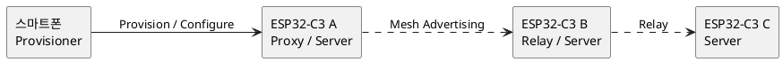

> 이관 원문: `examples/esp32c3/generic-onoff-node/README.md`. 현재 실행 경로는 [팀원 시작 안내](../../../00-team/START.md)를 따른다. 아래의 과거 명칭·명령·검증 범위는 기록 당시 내용이다.

# 01 — ESP32-C3 Generic OnOff Mesh Node

세 대 이상의 ESP32-C3에 **같은 펌웨어**를 올려 다음 기반 기능을 확인하는 첫 예제다.

- Unprovisioned Device 검색
- Provisioning과 주소 할당
- AppKey를 Generic OnOff Server에 Bind
- Unicast 및 Group On/Off 수신
- 선택한 노드만 Relay로 활성화
- 수신한 `src`, `dst`, `opcode`, On/Off 상태를 시리얼 로그로 확인

이 단계에는 Vendor Model, 센서, UART, 실제 LED 제어를 넣지 않았다. 기본 Mesh 설정 문제와 사용자 애플리케이션 문제를 분리하기 위해서다.

## 구조



세 보드는 같은 Composition을 가진다. Relay 지원도 모두 들어 있지만 초기 상태는 꺼져 있다. nRF Mesh 같은 Provisioner에서 B처럼 필요한 노드만 `Relay Enabled`로 설정한다.

## 기준 버전과 상태

- 대상: ESP32-C3
- 기준 소스: ESP-IDF `release/v6.1`의 공식 `onoff_server` 예제
- 라이선스: Apache-2.0 기반 코드
- 현재 검증: 공식 v6.1 소스와 API 구조 대조 완료
- 아직 미검증: 이 Mac에는 현재 `idf.py`와 `IDF_PATH`가 없어 실제 빌드·플래시하지 못함

## 빌드

ESP-IDF 환경을 활성화한 터미널에서 실행한다.

프로젝트 root에서 실행한다.

```bash
cd examples/esp32c3/generic-onoff-node
idf.py set-target esp32c3
idf.py build
```

보드를 연결하고 실제 포트를 지정한다.

```bash
idf.py -p /dev/cu.<실제포트> flash monitor
```

같은 빌드 결과를 나머지 보드에도 플래시한다. `ble_mesh_get_dev_uuid()`가 칩별 UUID를 생성하므로 같은 바이너리를 사용해도 Provisioner에서는 서로 다른 장치로 검색되어야 한다.

## 스마트폰 앱 설정

각 보드에 다음 작업을 수행한다.

1. Unprovisioned Device를 검색하고 Provision한다.
2. AppKey를 추가한다.
3. Primary Element의 `Generic OnOff Server`에 AppKey를 Bind한다.
4. 필요하면 Group Address 예: `0xC000`을 Subscription에 추가한다.
5. Relay 시험에 사용할 일부 노드만 Relay를 활성화한다.
6. Generic OnOff Set을 보내 모든 대상 노드의 시리얼 로그를 확인한다.

## 예상 로그

Provisioning 전:

```text
I (...) BIKE_MESH: ready: unprovisioned BLE Mesh node
I (...) device_uuid: ...
```

Provisioning 성공:

```text
I (...) BIKE_MESH: provisioned: net_idx=0x0000 addr=0x0001 ...
```

On/Off 수신:

```text
I (...) BIKE_MESH: model event=... opcode=... src=0x.... dst=0x....
I (...) BIKE_MESH: ONOFF state changed: ON
```

## 1단계 완료 기준

- [ ] ESP32-C3 세 대가 서로 다른 UUID로 검색된다.
- [ ] 세 대 모두 Provisioning된다.
- [ ] 세 대의 Generic OnOff Server에 AppKey가 Bind된다.
- [ ] Unicast On/Off를 보내면 지정한 노드만 로그가 출력된다.
- [ ] Group On/Off를 보내면 구독한 노드 모두 로그가 출력된다.
- [ ] 한 노드를 Relay로 켠 뒤 직접 닿지 않는 배치에서 A → B → C 전달을 로그로 확인한다.
- [ ] 재부팅 후에도 Provisioning 정보가 유지된다.

## 다음 단계

2단계에서는 같은 펌웨어 안에 Vendor Client와 Vendor Server를 함께 넣고, 버튼 또는 타이머로 다음과 같은 짧은 자전거 경고 패킷을 Group Address에 발행한다.

```c
typedef struct {
    uint16_t node_id;
    uint16_t sequence;
    uint8_t event_type;
    uint8_t severity;
} bike_warning_t;
```

현재 예제가 빌드되고 3보드 시험을 통과하기 전에는 Vendor 단계로 넘어가지 않는다.
