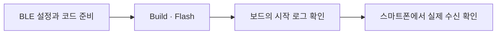

# 03. BLE Advertising — 스마트폰에서 보드 발견하기

[학습 순서](README.md) · [전체 시작 메뉴](../../README.md)

**목표: ESP32-S3가 보내는 BLE 신호를 스마트폰에서 실제로 수신한다.**

[02번](02-hardware-bringup.md)이 보드 안에서 앱 실행을 확인했다면, 이번에는 보드 밖에서 무선 신호를 확인한다.

실습 예제는 저장소에 준비된 [Layer 1](../../layers/layer-1/README.md)이다. 01~02번의 `my_ble`와는 **별도 프로젝트**이며, Flash하면 보드의 이전 프로그램을 교체한다. 현재 예제 설정은 **ESP32-S3 / Flash 16 MB** 기준이므로 다른 보드라면 먼저 설정을 맞춰야 한다.



## 1. BLE 기능 설정 확인하기

헤더를 `#include`하는 것만으로 BLE가 켜지는 것은 아니다. 빌드 설정과 초기화 코드도 필요하다.

- [sdkconfig.defaults](../../layers/layer-1/sdkconfig.defaults): Bluetooth와 Bluedroid를 켜는 초기 설정.
- [main/CMakeLists.txt](../../layers/layer-1/main/CMakeLists.txt): `main.c`와 필요한 `bt`, `nvs_flash` 컴포넌트를 지정.

Layer 1에는 이미 준비되어 있다. 실제 빌드는 저장된 `sdkconfig`를 사용하며, 나중에 defaults만 바꿔도 기존 설정이 자동으로 덮어써지지는 않는다.

## 2. 초기화와 Advertising 코드 살펴보기

[main/main.c](../../layers/layer-1/main/main.c)는 다음 순서로 동작한다. 지금은 함수 세부 구현보다 순서를 이해한다.

1. **NVS 초기화** — 설정 저장소를 준비한다.
2. **BLE Controller와 Bluedroid 초기화** — BLE를 구동할 하드웨어 제어부와 프로토콜 소프트웨어를 준비한다.
3. **광고 데이터 설정** — `ESP32-LAYER-1`이라는 이름을 넣는다.
4. **설정 완료 후 Advertising 시작** — 준비 완료 이벤트를 받은 뒤 주기적으로 신호를 보낸다.

Advertising은 주변에 “나 여기 있어”라고 알리는 방송이다. 이 예제는 **non-connectable**이므로 검색은 가능하지만 연결은 받지 않는다. [공식 Advertising·Scanning 개념 설명](https://docs.espressif.com/projects/esp-idf/en/stable/esp32s3/api-guides/ble/get-started/ble-device-discovery.html)

## 3. 빌드하고 보드에 기록하기

현재 Mac의 경로 기준이다. `my_ble`가 아니라 **Layer 1 프로젝트 폴더**에서 실행한다.

```bash
source /Users/kafka/esp/esp-idf-v5.5.5/export.sh
cd /Users/kafka/Workspace_AI/esp-ble/layers/layer-1
idf.py build
```

보드 한 대를 연결하고 [02번의 포트 확인 과정](02-hardware-bringup.md)을 따른다. 아래 `PORT`를 확인한 실제 포트 경로로 바꾼 뒤 실행한다. Flash는 해당 보드의 프로그램을 교체한다.

```bash
idf.py -p PORT flash
idf.py -p PORT monitor
```

## 4. 보드의 Advertising 시작 로그 확인하기

모니터에서 확인할 문구의 예시는 다음과 같다.

```text
[LAYER-1] ADVERTISING_STARTED name=ESP32-LAYER-1 type=non-connectable
[LAYER-1] ADVERTISING_ACTIVE count=1
```

`ADVERTISING_STARTED`는 BLE 스택이 시작 성공을 알린 로그다. `ADVERTISING_ACTIVE`는 코드가 그 상태를 읽어 반복 출력하는 로그이며, 송신 패킷마다 받은 확인 응답이 아니다.

**이 로그만으로 스마트폰이 신호를 받았다고 판단하지 않는다.** 모니터 종료는 `Ctrl + ]`다.

## 5. 스마트폰에서 실제 수신 확인하기

휴대폰의 일반 Bluetooth 설정 화면 대신 [nRF Connect for Mobile](https://www.nordicsemi.com/Products/Development-tools/nRF-Connect-for-mobile) 같은 BLE 스캐너 앱을 사용한다. 이 앱은 Advertising 데이터와 RSSI를 확인할 수 있다.

1. 휴대폰 Bluetooth를 켜고 앱에 필요한 Bluetooth 권한을 허용한다.
2. 앱의 스캔 기능으로 주변 기기를 검색한다.
3. `ESP32-LAYER-1`을 찾고 광고 데이터에 해당 이름이 있는지 확인한다.
4. 새 수신 시각·횟수 또는 RSSI 표시가 갱신되는지 확인한다. RSSI는 받은 신호의 세기이며, 값이 매번 달라질 필요는 없다.

**Connect는 누르지 않는다. 이번 목표는 연결이 아니라 발견과 수신이다.**

이전 검색 결과가 목록에 남아 있는 것만으로는 충분하지 않다. 혼동되면 보드 전원을 껐을 때 새 수신이 멈추고, 다시 켰을 때 재개되는지 비교한다. 확인한 이름, RSSI, 시각과 화면 캡처를 기록한다.

## 완료 기준

- 보드에서 Advertising 시작 성공 로그를 확인했다.
- 스마트폰에서 해당 보드의 광고를 새로 수신하는 것을 확인했다.

**둘 다 확인하면 이번 BLE Advertising 검증 완료.** GATT 연결·Read/Write나 Bluetooth Mesh를 검증한 것은 아니다.

이해 확인: 보드에 `ADVERTISING_ACTIVE`가 찍혔는데 왜 스마트폰 스캔도 해야 할까?

[이전: Hardware Bring-up](02-hardware-bringup.md) · [전체 학습 순서](README.md) · [이후 BLE Layer 로드맵](LAYER-ROADMAP.md)

이 문서는 실습 절차다. 이번 문서 작성 중에는 빌드·Flash·스마트폰 수신 검증을 수행하지 않았다.
