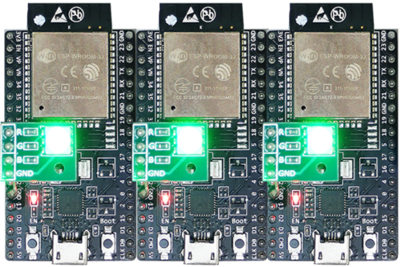
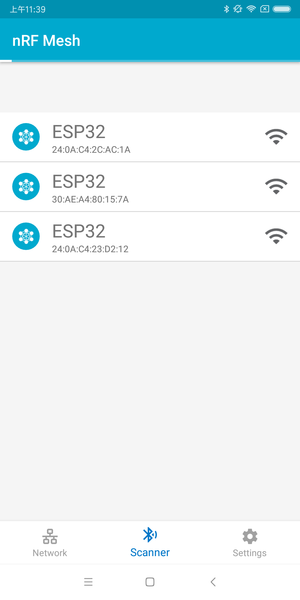
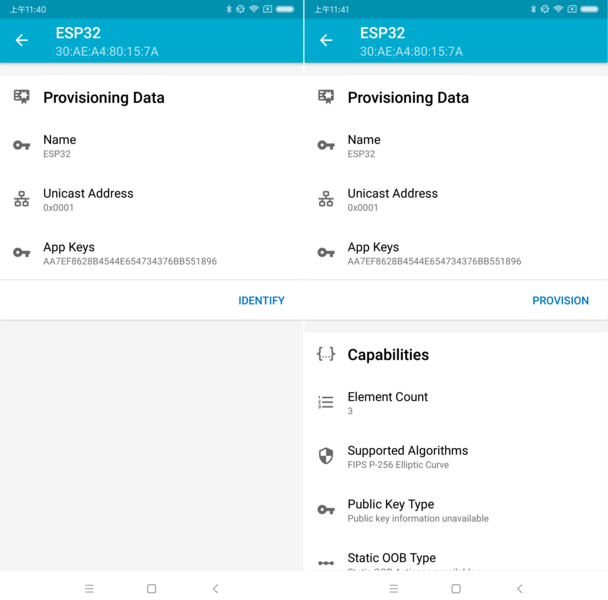
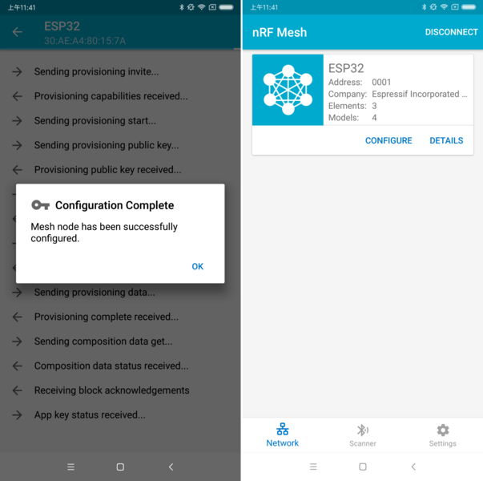
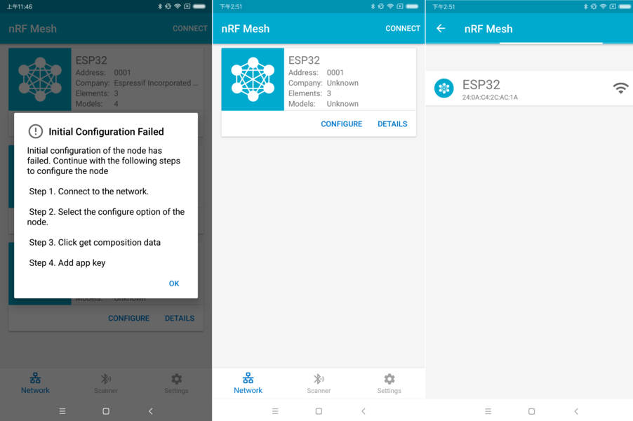
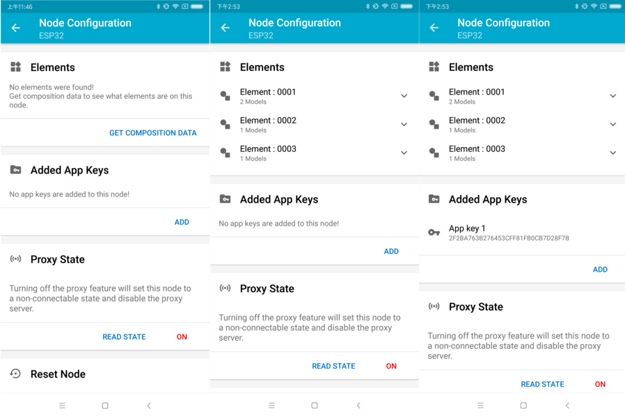
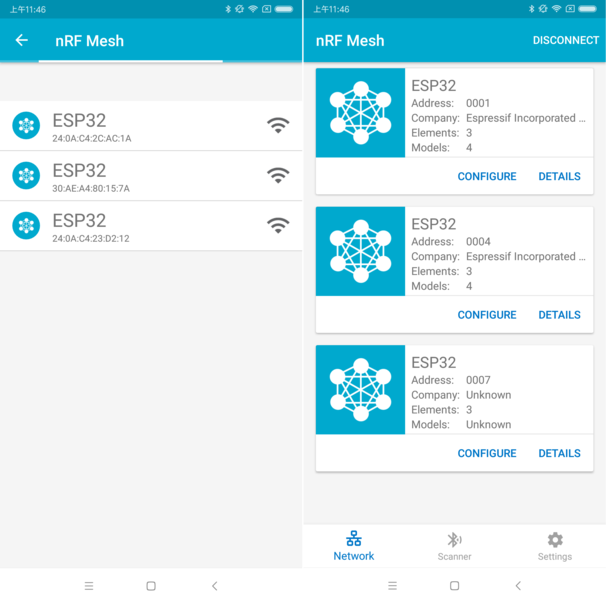
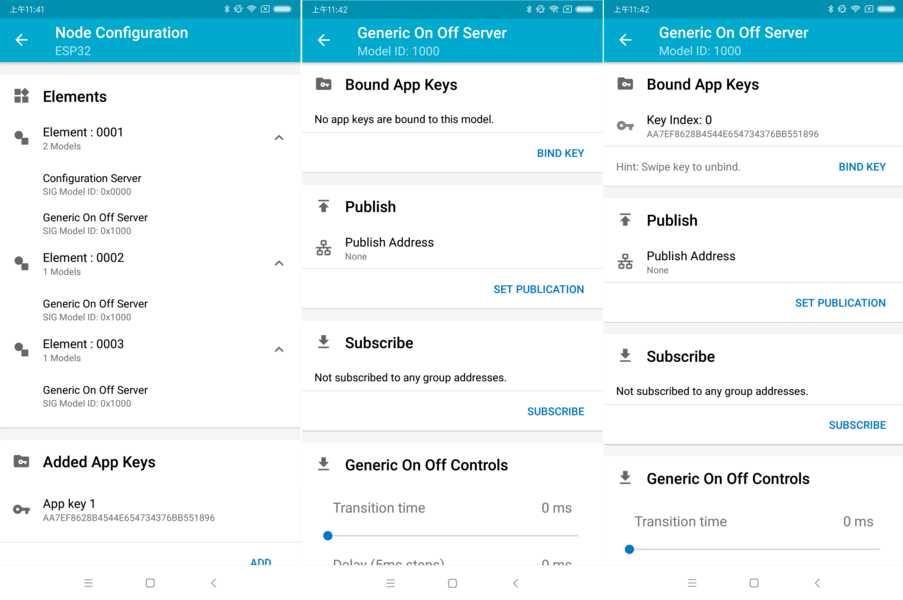
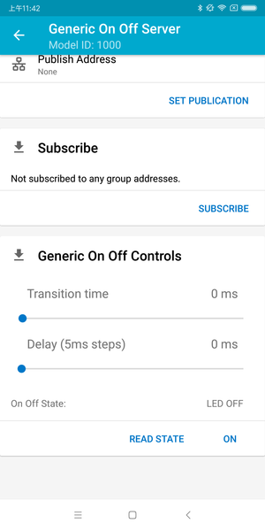
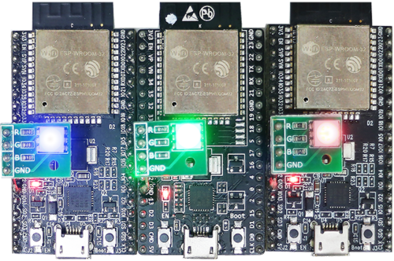

# ESP-BLE-MESH — ESP32-C3 한국어 설명

[전체 시작 메뉴](../../README.md) · [학습 순서](../02-learning/README.md)

> 원문: [Espressif ESP-BLE-MESH 시작 문서](https://docs.espressif.com/projects/esp-idf/en/stable/esp32c3/api-guides/esp-ble-mesh/ble-mesh-index.html)  
> 수집일: 2026-08-27  
> 설명 대상: ESP32-C3, ESP-IDF의 ESP-BLE-MESH  
> 검증 상태: 문서와 이미지 확인 완료 / 실제 보드 빌드·플래시 미검증

이 문서는 **ESP32-C3용 참고 자료**다. 현재 ESP32-S3 실습은 [Layer 로드맵](../02-learning/LAYER-ROADMAP.md)을, 보드 검증 상태는 [진행 기록](../01-project/STATUS.md)을 본다. C3 자료의 빌드·Flash 상태와 S3 결과를 섞지 않는다.

## 1. ESP-BLE-MESH가 무엇인가?

Bluetooth Mesh는 여러 장치가 서로 메시지를 전달하는 **다대다 네트워크 기술**이다. 새로운 무선 규격이 따로 있는 것이 아니라, Bluetooth Low Energy의 Advertising과 GATT를 전달 수단으로 사용한다.

```text
일반 BLE
스마트폰 또는 Central ↔ 센서 또는 Peripheral

Bluetooth Mesh
Node A ↔ Node B ↔ Node C ↔ 여러 Node
```

직접 전파가 닿지 않는 장치에도 중간 Relay Node가 메시지를 다시 전송할 수 있다. 이 때문에 조명, 건물 자동화, 센서 네트워크처럼 노드가 많은 시스템에 적합하다.

ESP-BLE-MESH는 다음 기능을 제공한다.

- Provisioning: 새 장치를 Mesh Network에 가입
- Node Configuration: 주소, 키, Model 설정
- Relay: 다른 노드의 메시지를 재전송
- Proxy: 스마트폰 같은 GATT 장치와 Mesh Advertising Network를 연결
- Low Power Node: 수신 시간을 줄여 전력 절약
- Friend Node: Low Power Node 대신 메시지를 보관

원문은 ESP-BLE-MESH가 Zephyr Bluetooth Mesh 코드를 기반으로 구현되었다고 설명한다. 그러나 이것은 매우 중요한 차이가 있다.

> **ESP-IDF의 ESP-BLE-MESH를 사용하는 것과 Zephyr RTOS 애플리케이션을 직접 만드는 것은 다르다.**

ESP-BLE-MESH 애플리케이션은 ESP-IDF 환경에서 `esp_ble_mesh_*` API를 사용한다. Zephyr를 직접 사용할 때는 Zephyr의 Kconfig, Devicetree, `bt_mesh_*` API를 사용한다.

## 2. 이 문서에서 만드는 것

원문의 시작 예제는 ESP32-C3 세 대를 작은 Mesh Network로 구성한다.

```text
스마트폰 Mesh App
        │ Provisioning / Configuration
        ▼
┌──────────┐  Mesh Message  ┌──────────┐
│ ESP32-C3 │ ◀────────────▶ │ ESP32-C3 │
│ Node 1   │                │ Node 2   │
└──────────┘                └──────────┘
        ▲                        ▲
        └──────────┬─────────────┘
                   │
              ┌──────────┐
              │ ESP32-C3 │
              │ Node 3   │
              └──────────┘
```

각 보드에는 Generic OnOff Server Model이 들어간다. 스마트폰 앱에서 On/Off 명령을 보내면 RGB LED 색상으로 결과를 확인한다.

## 3. 필요한 준비물

### Hardware

- ESP32-C3 개발보드 3개
- 데이터 전송이 가능한 USB 케이블 3개
- ESP-IDF를 설치할 Mac·Linux·Windows PC
- Android 또는 iOS 스마트폰·태블릿
- 보드에 RGB LED가 없다면 외부 LED와 저항

### Software

- ESP-IDF
- 예제: `bluetooth/esp_ble_mesh/onoff_models/onoff_server`
- Bluetooth Mesh Provisioner 앱
  - 원문 예시: nRF Mesh
  - 대안: EspBleMesh, Silicon Labs Mesh 앱

### 보드 관련 주의

원문의 `Step 1`에는 기존 ESP32-DevKitC와 ESP-WROVER-KIT, GPIO 25·26·27 내용이 함께 남아 있다. ESP32-C3는 핀 구성이 다르므로 이 번호를 그대로 사용하면 안 된다.

실제 구현에서는 다음 순서로 확인한다.

1. 사용하는 보드의 정확한 모델 확인
2. 예제의 `menuconfig` 보드 설정 확인
3. 보드 schematic과 RGB LED GPIO 확인
4. 필요하면 예제의 LED 핀만 보드에 맞게 수정

## 4. ESP-IDF 예제 빌드

ESP-IDF 환경을 활성화한 뒤 예제 디렉토리로 이동한다.

```bash
cd "$IDF_PATH/examples/bluetooth/esp_ble_mesh/onoff_models/onoff_server"
idf.py set-target esp32c3
idf.py menuconfig
idf.py build
```

`menuconfig`에서 보드와 예제 설정을 확인한다. 빌드가 성공하면 각 보드에 같은 펌웨어를 플래시한다.

```bash
idf.py -p <SERIAL_PORT> flash monitor
```

실제 Serial Port는 보드를 연결한 뒤 확인해야 한다. 세 보드를 동시에 연결하면 포트를 혼동하지 않도록 보드 번호와 포트를 기록한다.

## 5. 보드 부팅 확인

펌웨어가 정상 부팅하면 예제의 상태 표시 방식에 따라 RGB LED가 녹색으로 켜진다. 이 시점의 장치는 아직 Mesh Network에 가입되지 않은 **Unprovisioned Device**다.



확인할 항목:

- 세 보드 모두 정상 부팅하는가?
- 시리얼 로그에 Fatal Error나 반복 재부팅이 없는가?
- 각 장치가 서로 다른 Device UUID를 광고하는가?
- Provisioning 전 상태가 로그에 표시되는가?

## 6. Provisioning 과정

Provisioning은 새 장치에 Mesh Network 정보와 고유 주소를 안전하게 전달해 Node로 만드는 과정이다.

### 6.1 Scanner — 가입하지 않은 장치 찾기

스마트폰 Mesh 앱에서 Scanner를 실행한다. 주변의 Unprovisioned Device가 보내는 Beacon을 검색하면 세 장치가 목록에 나타나야 한다.



목록에 나타나지 않으면 다음을 확인한다.

- ESP32-C3가 계속 재부팅하고 있지 않은가?
- Bluetooth 권한과 위치 권한이 허용되었는가?
- 다른 Mesh Network에 이미 Provisioning된 보드가 아닌가?
- Device UUID가 세 보드에서 같지 않은가?

### 6.2 Identify — 어느 보드인지 식별하기

검색된 장치를 선택하면 앱이 BLE 연결을 시도하고 Mesh Provisioning Service를 찾는다. 연결에 성공하면 `IDENTIFY`와 `PROVISION` 단계로 진행한다.



원문 예제에서는 Identify 버튼을 눌러도 보드 외관에 눈에 띄는 변화가 없을 수 있으며 시리얼 로그로만 확인될 수 있다. 여러 보드를 다룰 때는 펌웨어에 LED 깜빡임 같은 Identify 동작을 추가하는 편이 안전하다.

### 6.3 Provision — 주소와 키를 전달하기

Provisioning이 성공하면 장치는 다음 정보를 받는다.

- 고유 Unicast Address
- Network Key
- Device Key
- IV Index 등 Mesh Network 상태

이후 앱은 보드와 다시 연결해 Composition Data를 읽고 AppKey를 추가하려고 한다.



Composition Data에는 Node의 Element와 Model 구성이 들어 있다. 앱은 이 정보를 읽어 어떤 Model에 AppKey를 연결할지 판단한다.

## 7. Provisioning 후 재연결 실패 처리

Provisioning이 성공했더라도 앱이 Node에 다시 연결하지 못할 수 있다. 이 경우 Unicast Address만 할당되고 Composition Data를 읽지 못한 상태가 된다.



이 상황은 Provisioning 실패와 다르다.

```text
Provisioning 성공
└── 주소와 Device Key는 이미 할당됨
    └── 앱의 재연결 또는 Composition Data 읽기가 실패할 수 있음
```

앱에서 `CONNECT`를 눌러 Provisioning된 Node에 다시 연결한 다음 Composition Data 읽기와 AppKey 추가를 계속한다.



여러 Node를 Provisioning했다면 재연결 목록에 두세 개의 Node가 함께 표시될 수 있다. 연결 후 Node별 Composition Data 상태를 확인한다.



실습 기록에는 다음 상태를 구분해 적는다.

| 상태 | 의미 | 다음 작업 |
|---|---|---|
| Unprovisioned | Network에 가입하지 않음 | Provisioning 시작 |
| Provisioned, 미설정 | 주소는 있지만 Composition/AppKey 설정 미완료 | 재연결 후 설정 계속 |
| Provisioned, 설정 완료 | 주소·Composition·AppKey 준비됨 | Model Bind와 Publish/Subscribe 설정 |

## 8. AppKey를 Model에 Bind하기

Provisioning만으로 애플리케이션 메시지를 바로 주고받을 수 있는 것은 아니다. Generic OnOff Server Model이 AppKey를 사용할 수 있도록 Bind해야 한다.



### 키의 역할

| 키 | 역할 |
|---|---|
| NetKey | 같은 Mesh Network의 Network Layer 통신 보호 |
| AppKey | 특정 애플리케이션 Model 메시지 보호 |
| DevKey | Provisioner가 해당 Node를 설정할 때 사용 |

Configuration Server Model은 일반 애플리케이션 AppKey가 아니라 DevKey로 설정 메시지를 처리하므로 AppKey Bind 대상이 아니다.

Bind가 끝난 뒤에는 필요에 따라 다음을 설정한다.

- Publication Address: Model이 상태를 발행할 대상
- Subscription Address: Model이 구독할 Group Address
- Publish TTL
- Retransmission 횟수와 간격

## 9. Generic OnOff로 네트워크 동작 확인

예제에는 세 개의 Generic OnOff Server Model이 있고 각각 RGB LED의 빨강·초록·파랑을 제어한다.



앱에서 On/Off 명령을 보내 다른 보드의 LED가 바뀌는지 확인한다.



검증할 때는 단순히 LED가 켜졌는지만 보지 말고 다음을 기록한다.

- 어느 Unicast 또는 Group Address로 보냈는가?
- 어떤 Element와 Model Instance가 처리했는가?
- 어떤 AppKey Index가 Bind되어 있는가?
- ACK가 필요한 메시지였는가?
- 시리얼 로그의 Source, Destination, Opcode는 무엇인가?

### 원문에 남아 있는 앱 버전 주의사항

원문은 `nRF Mesh iOS 1.0.4`에서 다중 Element Node의 두 번째·세 번째 Generic OnOff Server 제어가 첫 번째 Element로 잘못 전달될 수 있다고 기록한다. 이는 특정 과거 앱 버전 정보이므로 현재 설치한 앱에서도 같은 문제가 있다고 단정하면 안 된다. 문제가 발생하면 앱 버전과 실제 Destination Address를 함께 기록한다.

## 10. 주요 Mesh 용어

| 용어 | 쉬운 설명 |
|---|---|
| Unprovisioned Device | 아직 Mesh Network에 가입하지 않은 장치 |
| Node | Provisioning을 마치고 Network에 가입한 장치 |
| Element | Node 내부의 주소 단위 기능 블록 |
| Model | OnOff, Sensor처럼 메시지와 상태를 정의한 기능 |
| Composition Data | Node가 가진 Element와 Model의 목록 |
| Unicast Address | 하나의 Element를 가리키는 고유 주소 |
| Group Address | 여러 Model이 함께 구독할 수 있는 주소 |
| Publication | Model이 정해진 주소로 메시지를 발행하는 설정 |
| Subscription | 특정 Group 메시지를 받도록 등록하는 설정 |
| Provisioner | 새 장치를 Network에 가입·설정하는 장치 |
| Relay | 받은 Network PDU를 다시 광고하는 기능 |
| Proxy | 스마트폰 GATT와 Mesh Advertising을 연결하는 기능 |
| LPN | 수신 시간을 줄여 전력을 절약하는 Low Power Node |
| Friend | LPN이 잠든 동안 메시지를 보관하는 Node |

## 11. 원문에 소개된 예제

| 예제 경로 | 무엇을 배우는가? |
|---|---|
| `onoff_models/onoff_server` | Configuration Server와 Generic OnOff Server |
| `onoff_models/onoff_client` | Generic OnOff Client가 명령을 보내는 방법 |
| `provisioner` | ESP32가 다른 Node를 Provisioning하고 설정하는 방법 |
| `fast_provisioning` | 다수 장치를 빠르게 Provisioning하는 구조 |
| `sensor_models/sensor_client` | Sensor Client와 Provisioner 구성 |
| `sensor_models/sensor_server` | Sensor Server와 Sensor Setup Server |
| `vendor_models/vendor_client` | 제조사 전용 Client Model |
| `vendor_models/vendor_server` | 제조사 전용 Server Model |
| `wifi_coexist` | Wi-Fi와 ESP-BLE-MESH 동시 사용 |
| `remote_provisioning` | 기존 Mesh를 통한 원격 Provisioning |
| Directed Forwarding 관련 예제 | 모든 Relay가 아닌 선택된 경로 중심 전달 |

예제 경로는 ESP-IDF 버전에 따라 이동하거나 이름이 달라질 수 있다. 구현 전에 고정한 ESP-IDF checkout에서 실제 디렉토리를 확인한다.

## 12. 자전거 경고 프로젝트에 적용한다면

```text
STM32
├── 거리·충격·기울기 측정
├── 필터링과 위험 판단
└── UART Event 전송
        │
        ▼
ESP32-C3 Mesh Node
├── Sensor 또는 Vendor Model
├── Publish
├── Relay 선택 가능
└── 수신 시 LED·부저·OLED 제어
```

권장 구현 순서:

1. 원본 Generic OnOff Server 예제를 수정하지 않고 3보드에서 성공
2. 한 보드를 Provisioner로 만드는 예제 검증
3. Group Publish/Subscribe 검증
4. Sensor Model 검토
5. 필요한 데이터가 표준 Sensor Model에 맞지 않을 때만 Vendor Model 사용
6. STM32 UART 연결
7. 3노드 Relay 시험
8. 5노드 후 10노드 확장

## 13. 이 페이지가 증명하지 않는 것

- ESP32-C3 10개에서 사용자의 경고 메시지가 안정적으로 전달된다는 것
- 이동 중인 자전거 환경에서 Mesh가 안정적으로 유지된다는 것
- 모든 스마트폰 Mesh 앱 버전과 호환된다는 것
- Native Zephyr 애플리케이션이 같은 방식으로 바로 동작한다는 것
- 실제 도로 안전제품에 사용할 수 있는 신뢰성·보안 수준

따라서 이 문서는 **구현 출발점**이며, 실제 보드 로그와 단계별 시험 결과가 있어야 완료로 판단할 수 있다.

## 14. 관련 공식 문서

- [ESP-BLE-MESH 원문](https://docs.espressif.com/projects/esp-idf/en/stable/esp32c3/api-guides/esp-ble-mesh/ble-mesh-index.html)
- [ESP-IDF Get Started](https://docs.espressif.com/projects/esp-idf/en/stable/esp32c3/get-started/index.html)
- [ESP-BLE-MESH API](https://docs.espressif.com/projects/esp-idf/en/stable/esp32c3/api-reference/bluetooth/esp-ble-mesh.html)
- [ESP-BLE-MESH Terminology](https://docs.espressif.com/projects/esp-idf/en/stable/esp32c3/api-guides/esp-ble-mesh/ble-mesh-terminology.html)
- [ESP-IDF GitHub](https://github.com/espressif/esp-idf)


## 자료 보관 정보 — 2026-08-27 수집 기록


- 원문: [ESP-BLE-MESH - ESP32-C3](https://docs.espressif.com/projects/esp-idf/en/stable/esp32c3/api-guides/esp-ble-mesh/ble-mesh-index.html)
- 수집일: 2026-08-27
- 브라우저에서 확인된 문서 제목: `ESP-IDF Programming Guide v6.1`
- 이미지: 원문 본문에 포함된 10개 PNG를 원본 파일명으로 저장
- 상태: 한국어 설명과 이미지 링크 검증 완료, 실제 ESP32-C3 빌드·플래시는 아직 수행하지 않음

`stable` 주소는 향후 다른 ESP-IDF 버전을 가리킬 수 있으므로 실제 구현 시 사용 중인 ESP-IDF tag를 별도로 고정해야 한다.
