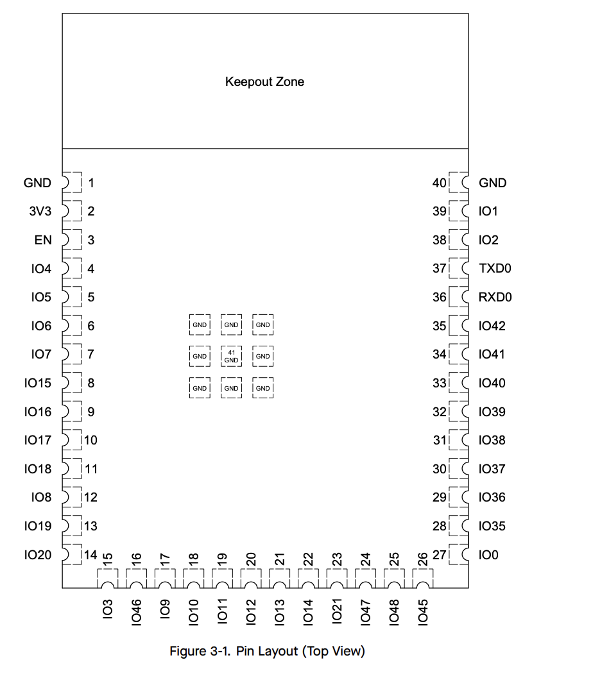

# ESP32-S3-N16R8 핀 참고 — 모듈 배치와 Pin Definitions

[프로젝트 시작 메뉴](../../README.md) · [Layer 8](../../layers/layer-8/README.md) · [현재 버튼/UART 시험 배선](../../layers/layer-8/FAST_CHECK.md)

저장일: 2026-08-28.

사용자가 제공한 **Figure 3-1. Pin Layout (Top View)**와 **Table 3-1. Pin Definitions** 두 페이지를 보존한 참고 문서다. 핀 기능명과 굵은 글씨는 첨부 표를 따르고, 원본 각주도 아래에 보존했다. 첨부 이미지에는 데이터시트 버전이 보이지 않으므로 특정 버전으로 단정하지 않는다.

프로젝트에서 사용하는 ESP32 세 대는 모두 **ESP32-S3-N16R8**이라고 사용자가 확인했다. 이는 사용자 제공 하드웨어 정보이며, 이 문서 작성 중 장치를 다시 스캔하거나 펌웨어를 설치한 것은 아니다.

## 1. 번호를 읽는 방법

- **Name / IO18 / GPIO18**: GPIO의 이름과 번호다. 펌웨어의 GPIO 설정과 대응한다.
- **No. / 모듈 패드 번호**: 모듈 외곽 또는 바닥의 물리적 패드 번호다. 개발보드 헤더 순번이 아니다.
- 예: **IO18 = GPIO18 = 모듈 패드 11번**이다. 모듈 패드 **18번은 IO10**이므로 혼동하지 않는다.
- 이 배치도는 모듈을 위에서 본 그림이다. 개발보드 전체의 헤더 배치도나 LED 회로도가 아니다.

| 자주 사용하는 이름 | GPIO 번호 | 모듈 패드 번호 | 첨부 표에 기재된 UART/USB 기능 |
| --- | ---: | ---: | --- |
| IO16 | 16 | 9 | U0CTS — UART0 흐름 제어 신호 |
| IO17 | 17 | 10 | U1TXD — UART1 TX |
| IO18 | 18 | 11 | U1RXD — UART1 RX |
| IO19 | 19 | 13 | USB_D- / U1RTS |
| IO20 | 20 | 14 | USB_D+ / U1CTS |
| RXD0 | 44 | 36 | U0RXD — UART0 RX |
| TXD0 | 43 | 37 | U0TXD — UART0 TX |

표에 기능이 나열되어 있다고 펌웨어가 그 기능을 자동으로 사용하는 것은 아니다. 실제 UART 핀은 소스의 설정과 함께 확인한다.

## 2. Pin Layout — 원본 배치도



안테나 쪽은 그림의 `Keepout Zone`, 중앙 접지 패드는 `41 / GND`다. 개발보드에서 배선할 때는 헤더의 GPIO 인쇄를 확인하며, 이 그림의 패드 순서를 개발보드 헤더 순서로 대입하지 않는다.

## 3. Table 3-1 — 전체 핀 정의

`[a]`, `[b]`, `[c]`는 다음 절의 원본 각주에 대응한다. **굵은 기능명은 원본 표의 기본 핀 기능 표시**를 보존한 것이다.

| Name | No. | Type [a] | Function |
| --- | ---: | --- | --- |
| GND | 1 | P | GND |
| 3V3 | 2 | P | Power supply |
| EN | 3 | I | High: on, enables the chip.<br>Low: off, the chip powers off.<br>Note: Do not leave the EN pin floating. |
| IO4 | 4 | I/O/T | RTC_GPIO4, **GPIO4**, TOUCH4, ADC1_CH3 |
| IO5 | 5 | I/O/T | RTC_GPIO5, **GPIO5**, TOUCH5, ADC1_CH4 |
| IO6 | 6 | I/O/T | RTC_GPIO6, **GPIO6**, TOUCH6, ADC1_CH5 |
| IO7 | 7 | I/O/T | RTC_GPIO7, **GPIO7**, TOUCH7, ADC1_CH6 |
| IO15 | 8 | I/O/T | RTC_GPIO15, **GPIO15**, U0RTS, ADC2_CH4, XTAL_32K_P |
| IO16 | 9 | I/O/T | RTC_GPIO16, **GPIO16**, U0CTS, ADC2_CH5, XTAL_32K_N |
| IO17 | 10 | I/O/T | RTC_GPIO17, **GPIO17**, U1TXD, ADC2_CH6 |
| IO18 | 11 | I/O/T | RTC_GPIO18, **GPIO18**, U1RXD, ADC2_CH7, CLK_OUT3 |
| IO8 | 12 | I/O/T | RTC_GPIO8, **GPIO8**, TOUCH8, ADC1_CH7, SUBSPICS1 |
| IO19 | 13 | I/O/T | RTC_GPIO19, GPIO19, U1RTS, ADC2_CH8, CLK_OUT2, **USB_D-** |
| IO20 | 14 | I/O/T | RTC_GPIO20, GPIO20, U1CTS, ADC2_CH9, CLK_OUT1, **USB_D+** |
| IO3 | 15 | I/O/T | RTC_GPIO3, **GPIO3**, TOUCH3, ADC1_CH2 |
| IO46 | 16 | I/O/T | **GPIO46** |
| IO9 | 17 | I/O/T | RTC_GPIO9, **GPIO9**, TOUCH9, ADC1_CH8, FSPIHD, SUBSPIHD |
| IO10 | 18 | I/O/T | RTC_GPIO10, **GPIO10**, TOUCH10, ADC1_CH9, FSPICS0, FSPIIO4, SUBSPICS0 |
| IO11 | 19 | I/O/T | RTC_GPIO11, **GPIO11**, TOUCH11, ADC2_CH0, FSPID, FSPIIO5, SUBSPID |
| IO12 | 20 | I/O/T | RTC_GPIO12, **GPIO12**, TOUCH12, ADC2_CH1, FSPICLK, FSPIIO6, SUBSPICLK |
| IO13 | 21 | I/O/T | RTC_GPIO13, **GPIO13**, TOUCH13, ADC2_CH2, FSPIQ, FSPIIO7, SUBSPIQ |
| IO14 | 22 | I/O/T | RTC_GPIO14, **GPIO14**, TOUCH14, ADC2_CH3, FSPIWP, FSPIDQS, SUBSPIWP |
| IO21 | 23 | I/O/T | RTC_GPIO21, **GPIO21** |
| IO47 [c] | 24 | I/O/T | SPICLK_P_DIFF, **GPIO47**, SUBSPICLK_P_DIFF |
| IO48 [c] | 25 | I/O/T | SPICLK_N_DIFF, **GPIO48**, SUBSPICLK_N_DIFF |
| IO45 | 26 | I/O/T | **GPIO45** |
| IO0 | 27 | I/O/T | RTC_GPIO0, **GPIO0** |
| IO35 [b] | 28 | I/O/T | SPIIO6, **GPIO35**, FSPID, SUBSPID |
| IO36 [b] | 29 | I/O/T | SPIIO7, **GPIO36**, FSPICLK, SUBSPICLK |
| IO37 [b] | 30 | I/O/T | SPIDQS, **GPIO37**, FSPIQ, SUBSPIQ |
| IO38 | 31 | I/O/T | **GPIO38**, FSPIWP, SUBSPIWP |
| IO39 | 32 | I/O/T | **MTCK**, GPIO39, CLK_OUT3, SUBSPICS1 |
| IO40 | 33 | I/O/T | **MTDO**, GPIO40, CLK_OUT2 |
| IO41 | 34 | I/O/T | **MTDI**, GPIO41, CLK_OUT1 |
| IO42 | 35 | I/O/T | **MTMS**, GPIO42 |
| RXD0 | 36 | I/O/T | **U0RXD**, GPIO44, CLK_OUT2 |
| TXD0 | 37 | I/O/T | **U0TXD**, GPIO43, CLK_OUT1 |
| IO2 | 38 | I/O/T | RTC_GPIO2, **GPIO2**, TOUCH2, ADC1_CH1 |
| IO1 | 39 | I/O/T | RTC_GPIO1, **GPIO1**, TOUCH1, ADC1_CH0 |
| GND | 40 | P | GND |
| EPAD | 41 | P | GND |

## 4. 원본 각주와 사용 제한

### [a] Type과 기본 기능

> P: power supply; I: input; O: output; T: high impedance. Pin functions in bold font are the default pin functions. For pin 28 ~ 30, the default function is decided by eFuse bit.

`P`는 전원, `I`는 입력, `O`는 출력, `T`는 고임피던스다. 모듈 패드 28~30번(IO35~IO37)의 기본 기능은 eFuse bit로 결정된다는 예외를 함께 읽는다.

### [b] Octal SPI PSRAM과 IO35~IO37

> For modules with Octal SPI PSRAM, i.e., modules embedded with ESP32-S3R8 or ESP32-S3R16V, pins IO35, IO36, and IO37 are connected to the Octal SPI PSRAM and are not available for other uses.

ESP32-S3R8 또는 ESP32-S3R16V를 내장한 Octal SPI PSRAM 모듈에서는 **IO35·IO36·IO37을 다른 용도로 사용할 수 없다**. 표에 GPIO로 나타난다는 이유만으로 빈 핀으로 취급하지 않는다.

### [c] ESP32-S3R16V의 GPIO47/48 전압

> For modules embedded with ESP32-S3R16V, as the VDD_SPI voltage of the ESP32-S3R16V chip is set to 1.8 V, the working voltage for GPIO47 and GPIO48 is also 1.8 V, which is different from other GPIOs.

이 1.8V 조건은 **ESP32-S3R16V 내장 모듈**에 관한 각주다. 현재 보드의 `N16R8` 이름에 `16`이 들어 있다는 이유만으로 R16V 조건을 적용하지 않는다.

## 5. 현재 Layer 8 UART 설정과 연결 메모

아래는 **2026-08-28 소스/시험 문서 기준 스냅샷**이다. 핀 정의표 자체와는 별개이며, 이후 펌웨어를 변경하면 실제 소스를 다시 확인한다. 배선이나 메시지 수신이 실물에서 성공했다는 증거는 아니다.

[Layer 8 bridge_runtime.c](../../layers/layer-8/main/bridge_runtime.c):

```c
#define DATA_UART UART_NUM_1
#define UART_TX_GPIO 17
#define UART_RX_GPIO 18
```

| 용도 | STM32 NUCLEO-F411RE | ESP32-S3 |
| --- | --- | --- |
| 버튼 이벤트 송신 | D8 / PA9 / USART1_TX | IO18 / GPIO18 / UART1_RX |
| 반대 방향 수신 — 사용할 경우 | D2 / PA10 / USART1_RX | IO17 / GPIO17 / UART1_TX |
| 공통 기준 전압 | GND | GND |
| 외부 버튼 입력 | D10 / PB6 → 버튼 → GND | 직접 연결하지 않음 |

UART는 115200 baud, 8-N-1, flow control 없음이다. 현재 단방향 시험에서는 반대 방향 선을 분리한다. ESP32의 UART0 `RXD0/TXD0`와 현재 사용하는 UART1 `IO18/IO17`은 다른 핀이다.

STM32의 현재 실제 송신은 USART1이며, USART2는 ST-LINK USB 진단 복사본에 사용한다. 예전 D0/D1 배선 메모를 현재 배선으로 사용하지 않는다. 관련 소스는 [STM32 main.c](../../stm32-project/integration/stm32/Core/Src/main.c), 상세 시험 안내는 [FAST_CHECK.md](../../layers/layer-8/FAST_CHECK.md)를 따른다.

각 보드에 USB로 전원을 공급할 때 보드 사이의 3V3/5V 전원 레일은 서로 연결하지 않는다. 배선 변경은 전원을 끄고 진행한다.

## 6. 이 자료만으로 확정할 수 없는 것

- 개발보드의 헤더 순서와 `RX/TX` 인쇄 위치: 실제 개발보드 핀맵 또는 회로도로 확인한다.
- 온보드 RGB LED의 연결 GPIO: 이 모듈 표에는 LED 연결이 없다. **GPIO38 또는 GPIO48이라고 단정하지 않는다.**
- LED 동작의 구현/설치 여부, UART 수신, Mesh 전달 성공: 이 문서는 핀 참고 자료이며 실행 검증 기록이 아니다.

## 7. 원본 이미지와 출처

사용자가 2026-08-28 대화에 첨부한 이미지 3장을 수정 없이 프로젝트에 복사했다. 임시 클립보드 경로 대신 아래 로컬 파일을 사용한다.

- [Figure 3-1 — Pin Layout (Top View)](../../images/esp32-s3-pinout/module-pin-layout-top-view.png)
- [Table 3-1 — Pin Definitions, 패드 1~31](../../images/esp32-s3-pinout/pin-definitions-1.png)
- [Table 3-1 — 계속, 패드 32~41 및 각주](../../images/esp32-s3-pinout/pin-definitions-2.png)

관련 공식 문서: [Espressif ESP32-S3-WROOM-1 / ESP32-S3-WROOM-1U Datasheet](https://documentation.espressif.com/esp32-s3-wroom-1_wroom-1u_datasheet_en.pdf). 이 Markdown의 전사 기준은 첨부 이미지이며, 온라인 문서는 개정되어 내용이 달라질 수 있다.
